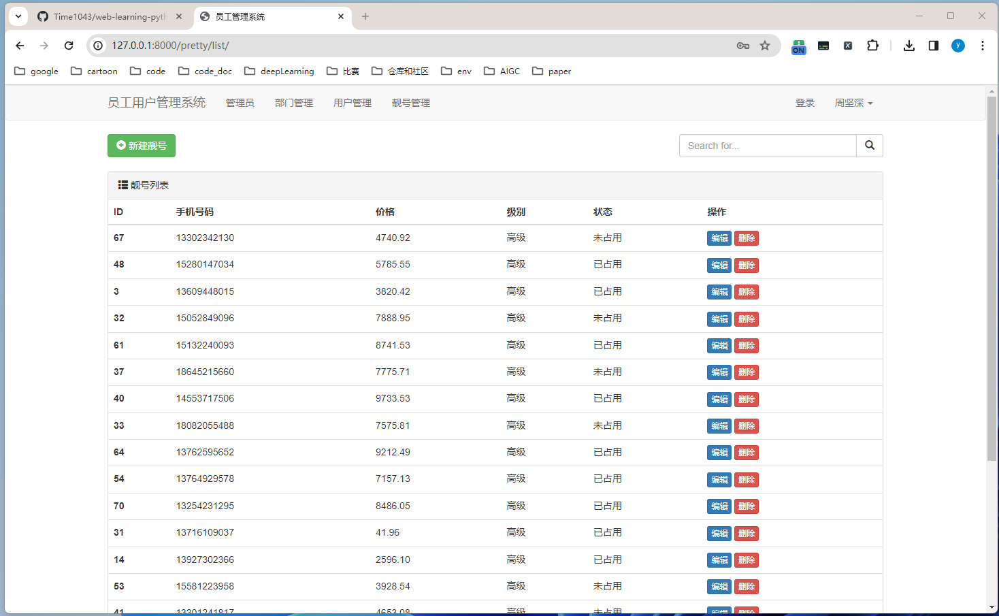
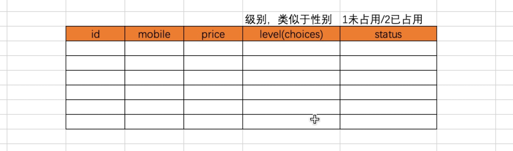
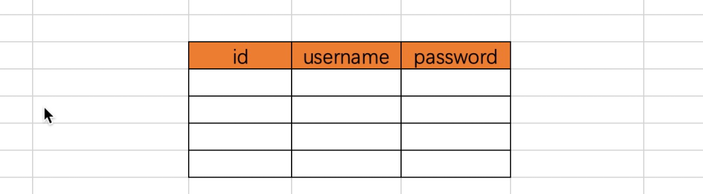
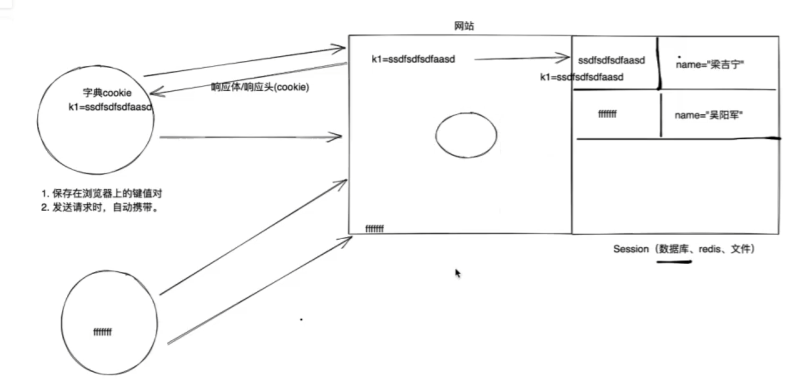
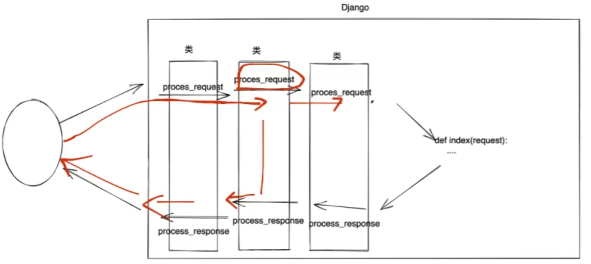
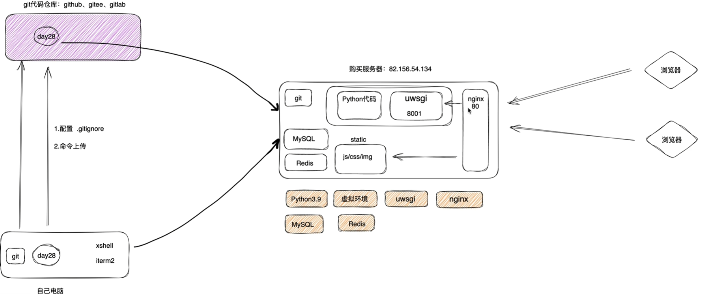

# web-learning-python

- 介绍

  这是基础性的python-web学习，目前仅包含一个django前后端不分离的项目，后续会有flask、DRF、前后端分离项目的学习。

- 定位

  flask：小巧、功能有限

  django：集成很多组件

  DRF


# user_manage_django

- 展示

  

- 参考

  [django官方文档](https://docs.djangoproject.com/zh-hans/4.2/)、[博客文章](https://www.cnblogs.com/wupeiqi/)、[交流博客](https://www.xinyan666.fun/article/article_list/)、[沛齐博客](https://www.cnblogs.com/wupeiqi/articles/5812291.html)

  [Django学习小组](https://zhuanlan.zhihu.com/djstudyteam)、[Django日程管理系统](https://zhuanlan.zhihu.com/p/52991783)


## 基础知识

- 前置

  [bootstrap](https://v3.bootcss.com/css/)


### 环境创建

- 安装django

  ```
  conda info -e
  conda create -n forWeb python=3.8
  conda activate forWeb
  
  pip install django
  
  
  # 依赖清单
  pip freeze > requirements.txt  # 生成依赖项清单
  pip intall -r requirements.txt  # 读取安装
  
  ```
  
  python文件结构
  
  
  > 1 python.exe
  >
  > 2 Scripts：pip.exe、创建项目的工具 `django-admin.exe`  // 加入环境变量
  >
  > 3 Lib：内置模块、site-packages(`第三方模块django框架源码`)
  
  创建项目 (命令行 pycharm)
  
  ```
  cd D:\code2\python-code\user-manage-learning
  django-admin startproject user_manage_django
  
  # 命令行创建：最标准
  # pycharm创建：在标准的基础上多加templates、settings.py数据
  
  ```
  
  项目结构
  
  > 1 manage.py		// 项目管理：启动项目、创建app、数据管理		【直接用】
  >
  > 2 django230926项目同名文件夹
  >
  > ​	\_\_init__.py
  >
  > ​	asgi.py		// 接受网络请求																【不管】
  >
  > ​	wsgi.py		// 接受网络请求																【不管】
  >
  > ​	urls.py		// url和python函数对应关系																  【操作】
  >
  > ​	setting.py	 // 项目配置文件：数据库连接、注册app											【操作】
  
  
  
  


- 创建app (划分功能)

  app用户管理		// 独立的表结构 函数  HTMLCSS模板

  app订单管理		// 独立的表结构 函数  HTMLCSS模板

  app后台管理		// 独立的表结构 函数  HTMLCSS模板

  ```
  python manage.py startapp app01
  python manage.py startapp app02
  tree /f
  
  ```

  APP的文件结构

  ```
  (forWeb) user_manage_django>tree /f
  卷 软件 的文件夹 PATH 列表
  卷序列号为 6C7E-ECA6
  D:.
  │  manage.py
  │  
  ├─.idea
  │  │  .gitignore
  │  │  user_manage_django.iml
  │  │  misc.xml
  │  │  modules.xml
  │  │  workspace.xml
  │  │
  │  └─inspectionProfiles
  │          profiles_settings.xml
  │
  ├─app01
  │  │  admin.py		【不管】ajango后台管理
  │  │  apps.py		【不管】app启动类
  │  │  models.py		数据库操作【重要】
  │  │  tests.py		【不管】单元测试
  │  │  views.py		url对应的视图函数【重要】
  │  │  __init__.py
  │  │
  │  └─migrations		【不管】数据库变更记录
  │          __init__.py
  │
  ```

  

- 注册app

  user-manage\user_manage_django\user_manage_django\settings.py

  ```python
  
  INSTALLED_APPS = [
      'app01.apps.App01Config',
  ]
  
  ```

  [url](https://docs.djangoproject.com/en/3.2/topics/http/urls/)和视图函数的对应关系

  user-manage\user_manage_django\user_manage_django\urls.py

  ```python
  from django.contrib import admin
  from django.urls import path
  
  from app01 import views
  
  urlpatterns = [
      path('admin/', admin.site.urls),
      path('index/', views.index)
  ]
  
  ```

  veiw函数 (接受用户请求)

  user-manage\user_manage_django\app01\views.py

  ```python
  from django.shortcuts import render, HttpResponse
  
  
  def index(request):
      return HttpResponse('欢迎使用')
  
  ```

  启动django项目 (命令行 pycharm)

  ```
  python manage.py runserver
  
  ```

  

### templates static

- 多个页面的url与view对应关系、templates模板 (想返回给用户html)

  ```
  mkdir -p app01/templates 
  mkdir -p app01/static/css app01/static/img app01/static/js app01/static/plugins
  
  ```

  ```python
  from django.shortcuts import render, HttpResponse
  
  
  def index(request):
      return render(request, "index.html")
  
  ```

  静态文件 (css js img)

  方法一：`"`

  方法二：``

  user_manage_django\app01\templates\index.html

  ```html
  
  <!DOCTYPE html>
  <html lang="en">
      <head>
          <meta charset="UTF-8">
          <title>index</title>
          <link rel="stylesheet" href="">
      </head>
  
  
      <body>
          <script src=""></script>
          <script src=""></script>
          
          <h1>欢迎来到用户中心</h1>
          
      </body>
  </html>
  ```

  user-manage\user_manage_django\user_manage_django\settings.py

  ```python
  # Static files (CSS, JavaScript, Images)
  # https://docs.djangoproject.com/en/3.2/howto/static-files/
  
  STATIC_URL = '/static/'
  
  ```

  

### 模板语法

- 作用：在HTML中写一些占位符，由数据对这些占位符进行替换和处理

  

  user_manage_django\user_manage_django\urls.py

  ```python
  from django.contrib import admin
  from django.urls import path
  
  from app01 import views
  
  urlpatterns = [
      path("admin/", admin.site.urls),
      path("index/", views.index),
      path('user/list/', views.user_list),
      path('user/add/', views.user_add),
      path('tpl/', views.tpl),
      path('news/', views.news),
      path('reqresp/', views.reqresp),
      path('login/', views.login),
      path('orm/', views.orm),
  ]
  ```

  user_manage_django\app01\views.py

  ```python
  from django.shortcuts import render, HttpResponse
  
  
  # Create your views here.
  
  def index(request):
      return HttpResponse('欢迎使用')
  
  
  def user_list(request):
      return render(request, 'user_list.html')
  
  
  def user_add(request):
      return render(request, 'user_add.html')
  
  
  def tpl(request):
      name = '周坚深'  # 模拟数据库拿取
      roles = ['员工', '组长', '经理', '工程师']
      user_info = {'name': '沈以容', 'salary': '50k', 'role': '工程师'}
      list_dict = [
          {'name': '沈以容', 'salary': '50k', 'role': '工程师'},
          {'name': '涂尔干', 'salary': '30k', 'role': '思想家'},
          {'name': '孟德斯鸠', 'salary': '40k', 'role': '思想家'}
      ]  # 列表里套字典
      return render(request, 'tpl.html', {'n1': name, 'n2': roles, 'n3': user_info, 'n4': list_dict})
  
  ```

  user_manage_django\app01\templates\tpl.html

  ```html
  <!DOCTYPE html>
  <html lang="en">
      <head>
          <meta charset="UTF-8">
          <title>模板语法</title>
      </head>
      <body>
          <h1>模板语法</h1>
          <h3>单个变量</h3>
          <div>{{ n1 }}</div>
  
          <hr/>
          <h3>数组取值</h3>
          <div>{{ n2.0 }}</div>
          <div>{{ n2.1 }}</div>
          <div>{{ n2.2 }}</div>
  
          <h3>数组循环</h3>
          <div>
              
                  <span>{{ item }}</span>
              
          </div>
  
          <hr/>
          <h3>字典取值</h3>
          <div>
              {{ n3 }}
              {{ n3.name }}
              {{ n3.salary }}
              {{ n3.role }}
          </div>
  
          <h3>循环字典的键</h3>
          <ul>
              
                  <li>{{ k }}</li>
              
          </ul>
          <h3>循环字典的值</h3>
          <ul>
              
                  <li>{{ v }}</li>
              
          </ul>
          <h3>循环字典的键值对</h3>
          <ul>
              
                  <li>{{ k }} ==> {{ v }}</li>
              
          </ul>
  
          <hr/>
          <h3>列表里套字典</h3>
          {{ n4.1 }}
          {{ n4.1.role }}
  
          <h3>循环</h3>
          <table border="1">
              <thead>
                  <tr>
                      <th>Name</th>
                      <th>Salary</th>
                      <th>Role</th>
                  </tr>
              </thead>
              <tbody>
                  
                      <tr>
                          <td>{{ item.name }}</td>
                          <td>{{ item.salary }}</td>
                          <td>{{ item.role }}</td>
                      </tr>
                  
              </tbody>
          </table>
  
          <hr/>
          <h3>条件语句</h3>
          
              <h5>欢迎您，沈以容</h5>
          
              <h5>也欢迎您，周坚深</h5>
          
              <h5>对不起，您是陌生用户</h5>
          
  
      </body>
  </html>
  
  ```

  

- 【案例】联通新闻中心

  ...

  


### 传递数据 (请求和响应)

- view函数处理

  ```python
  def reqresp(request):  # request对象 封装了用户通过浏览器发送过来的所有请求数据
      print(request.method)  # 用户的请求方式 get
      print(request.GET)  # 接受用户在url上传递一些值 <QueryDict: {'n': ['123'], 'p': ['asd']}>
  
      # return HttpResponse('返回内容')  # 【响应】将指定内容响应
      # return render(request, 'reqresp.html', {'np': request.GET})  # 【响应】将指定内容响应  读取html + 渲染替换 -> 字符串
      return redirect('https://www.baidu.com')  # 【响应】重定向到其他网页
  
  ```

  

- 【案例】用户登录

  django比flask多一层安全机制验证：``，否则是非法请求

  ```python
  def login(request):
      if request.method == 'GET':
          return render(request, 'login.html')
  
      # 不是get而是post
      username = request.POST.get('user')
      password = request.POST.get('pwd')
      if username == 'root' and password == '123':
          return redirect('https://www.baidu.com')
      # 否则登录失败
      return render(request, 'login.html', {'error_msg': '用户名或密码错误'})
  ```

  ```html
  <!DOCTYPE html>
  <html lang="en">
      <head>
          <meta charset="UTF-8">
          <title>欢迎登录</title>
      </head>
      <body>
          <h1>欢迎来到丑兮兮的登录界面</h1>
          <form method="post" action="/login/">
              
              <input type="text" name="user" placeholder="用户名">
              <input type="password" name="pwd" placeholder="密码">
              <input type="submit" value="提交">
              <span style="color: red">{{ error_msg }}</span>
          </form>
      </body>
  </html>
  ```

  

### 数据库ORM操作

- MySQL数据库 + pymysql

  ```python
  import pymysql
  
  # 1.连接MySQL
  conn = pymysql.connect(host="127.0.0.1", port=3306, user='root', passwd="root123", charset='utf8', db='unicom')
  cursor = conn.cursor(cursor=pymysql.cursors.DictCursor)
  
  # 2.发送指令
  cursor.execute("insert into admin(username,password,mobile) values('wupeiqi','qwe123','15155555555')")
  conn.commit()
  
  # 3.关闭
  cursor.close()
  conn.close()
  ```

  Django开发操作数据库更简单，内部提供了ORM框架

  ORM可以帮助我们做两件事：

  1 创建、修改、删除数据库中的表（不用你写SQL语句） 【无法创建数据库】

  2 操作表中的数据（不用你写SQL语句）

  

  
  
  
  
- [安装第三方模块支持](https://pypi.org/project/mysqlclient/#files)

  ```
  pip install mysqlclient
  
  ```

  自己创建数据库

  ```
  mysql -uroot -p123456
  create database forWeb;
  use forWeb;
  
  ```

  django连接数据库

  D:\code2\python-code\user-manage\user_manage_django\user_manage_django\settings.py

  ```python
  # Database
  # https://docs.djangoproject.com/en/3.2/ref/settings/#databases
  
  DATABASES = {
      'default': {
          'ENGINE': 'django.db.backends.mysql',
          'NAME': 'forWeb',
          'USER': 'root',
          'PASSWORD': '123456',
          'HOST': '127.0.0.1',
          'PORT': '3306',
      }
  }
  ```
  
  
  
- django操作表结构

  创建表、删除表、修改表

  D:\code2\python-code\user-manage\user_manage_django\app01\models.py (创建表)

  ```python
  from django.db import models
  
  
  class UserInfo(models.Model):
      name = models.CharField(max_length=32)
      password = models.CharField(max_length=32)
      age = models.IntegerField()
      # ORM根据相关信息自己写sql
  
  
  """
  create table app01_userinfo(
      id bignit auto_increment primary key,
      name varchar(32),
      password varchar(32),
      age int
  );
  """
  ```
  
  执行使得ORM转化为sql (在当前项目的根目录)
  
  ```
  python manage.py makemigrations  # 为这些更改创建迁移  用来修改数据库结构(而不是数据)  时间戳
  python manage.py migrate  # 应用那些由makemigrations创建的迁移
  # desc app01_userinfo;
  
  ```
  
  增加表删除表
  
  ```python
  class Department(models.Model):
      title = models.CharField(max_length=16)
  
  
  # class Role(models.Model):
  #     caption = models.CharField(max_length=16)
  ```
  
  在表中新增列
  
  ```python
  class UserInfo(models.Model):
      name = models.CharField(max_length=32)
      password = models.CharField(max_length=32)
      age = models.IntegerField(default=2)
      # size = models.IntegerField()
      
  """
  在表中新增列时，由于已存在列中可能已有数据，所以新增列必须要指定新增列对应的数据：
  1 手动输入一个值
  2 设置默认值  age = models.IntegerField(default=2)
  3 允许为空  data = models.IntegerField(null=True, blank=True)
  
  
  以后在开发中如果想要对表结构进行调整：
  在models.py文件中操作类即可
  python manage.py makemigrations
  python manage.py migrate
  """
  ```
  
  

- 填表中的数据

  views.py

  ```python
  def orm(request):
      # 1 新增数据
      Department.objects.create(title='销售部')
      Department.objects.create(title='财务部')
      Department.objects.create(title='市场部')
      UserInfo.objects.create(name='周坚深', password='fgh', age='33')
      UserInfo.objects.create(name='沈以容', password='asd', age='22')
      # UserInfo.objects.create(name='林云', password='123')  # err
  
      # 2 删除数据
      UserInfo.objects.filter(name='林云').delete()
      Department.objects.all().delete()
  
      # 3 获取符合条件的数据
      list_date = UserInfo.objects.all()
      for obj in list_date:
          print(obj.id, obj.name, obj.password, obj.age)
  
      list_date = UserInfo.objects.filter(id=1)  # <QuerySet [<UserInfo: UserInfo object (1)>]>
      print(list_date)
      
      row_obj = UserInfo.objects.filter(id=1).first()  # 获取第一条数据  对象
      print(row_obj.id, row_obj.name, row_obj.password, row_obj.age)
  
      # 4 更新数据
      UserInfo.objects.all().update(password=999)
      UserInfo.objects.filter(id=2).update(age=99)
      UserInfo.objects.filter(name='周坚深').update(age=43)
  
      return HttpResponse('成功')
      # return render(request, 'orm.html')
  ```

  

  

### 【案例】用户管理

- 用户管理

  1 展示用户列表：urls、函数(获取用户数据、html渲染)

  2 添加用户：urls、函数(get看到页面、post提交)

  3 删除用户：urls、函数、加入info_list.html

  

  路由

  ```
  from django.contrib import admin
  from django.urls import path
  
  from app01 import views
  
  urlpatterns = [
      path("admin/", admin.site.urls),
      path("depart/list/", views.depart_list),
      path("depart/add/", views.depart_add),
      path("depart/dlt/", views.depart_dlt),
  ]
  ```

  视图函数

  ```python
  from django.shortcuts import render, redirect
  
  from app01.models import Department
  
  
  def depart_list(request):
      """ 部门列表 """
      list_depart = Department.objects.all()  # 数据库获取数据
      return render(request, 'depart_list.html', {'list_depart': list_depart})
  
  
  def depart_add(request):
      """ 部门添加 """
      if request.method == 'GET':
          return render(request, 'depart_add.html')
      # POST  获取用户提交数据  保存到数据库
      title = request.POST.get('title')
      Department.objects.create(title=title)
      return redirect('/depart/list/')  # 重定向
  
  
  def depart_dlt(request):
      """ 部门删除 """
      depart_id = request.GET.get('nid')
      Department.objects.filter(id=depart_id).delete()
      return redirect('/depart/list/')
  ```

  D:\code2\python-code\user-manage\user_manage_django\app01\templates\depart_list.html

  ```html
  
  <!DOCTYPE html>
  <html lang="en">
      <head>
          <meta charset="UTF-8">
          <title>部门列表</title>
          <link rel="stylesheet" href="">
      </head>
  
  
      <body>
          <script src=""></script>
          <script src=""></script>
  
          <!--导航栏-->
          <nav class="navbar navbar-default">
              <div class="container">
                  <!-- Brand and toggle get grouped for better mobile display -->
                  <div class="navbar-header">
                      <button type="button" class="navbar-toggle collapsed" data-toggle="collapse"
                              data-target="#bs-example-navbar-collapse-1" aria-expanded="false">
                          <span class="sr-only">Toggle navigation</span>
                          <span class="icon-bar"></span>
                          <span class="icon-bar"></span>
                          <span class="icon-bar"></span>
                      </button>
                      <a class="navbar-brand" href="#">员工用户管理系统</a>
                  </div>
  
                  <!-- Collect the nav links, forms, and other content for toggling -->
                  <div class="collapse navbar-collapse" id="bs-example-navbar-collapse-1">
                      <ul class="nav navbar-nav">
                          <li><a href="/depart/list">部门管理</a></li>
                          <li><a href="#">用户管理</a></li>
                      </ul>
                      <ul class="nav navbar-nav navbar-right">
                          <li><a href="#">登录</a></li>
                          <li class="dropdown">
                              <a href="#" class="dropdown-toggle" data-toggle="dropdown" role="button"
                                 aria-haspopup="true" aria-expanded="false">周坚深 <span class="caret"></span></a>
                              <ul class="dropdown-menu">
                                  <li><a href="#">个人资料</a></li>
                                  <li><a href="#">我的信息</a></li>
                                  <li role="separator" class="divider"></li>
                                  <li><a href="#">注销</a></li>
                              </ul>
                          </li>
                      </ul>
                  </div><!-- /.navbar-collapse -->
              </div><!-- /.container-fluid -->
          </nav>
  
          <!--主界面-->
          <div>
              <div class="container">
                  <!--按钮-->
                  <div style="margin-bottom: 10px">
                      <a class="btn btn-success" href="/depart/add/">
                          <span class="glyphicon glyphicon-plus-sign" aria-hidden="true"></span>
                          新建部门
                      </a>
                  </div>
  
                  <!--表格 面板-->
                  <div class="panel panel-default">
                      <!-- Default panel contents -->
                      <div class="panel-heading"><font style="vertical-align: inherit;"><font
                              style="vertical-align: inherit;">
                          <span class="glyphicon glyphicon-th-list" aria-hidden="true"></span>
                          部门列表
                      </font></font></div>
  
                      <!-- Table -->
                      <table class="table">
                          <thead>
                              <tr>
                                  <th><font style="vertical-align: inherit;"><font
                                          style="vertical-align: inherit;">ID</font></font></th>
                                  <th><font style="vertical-align: inherit;"><font
                                          style="vertical-align: inherit;">名称</font></font></th>
                                  <th><font style="vertical-align: inherit;"><font
                                          style="vertical-align: inherit;">操作</font></font></th>
                              </tr>
                          </thead>
                          <tbody>
                              
                                  <tr>
                                      <th scope="row"><font style="vertical-align: inherit;"><font
                                              style="vertical-align: inherit;">{{ depart.id }}</font></font></th>
                                      <td><font style="vertical-align: inherit;"><font
                                              style="vertical-align: inherit;">{{ depart.title }}</font></font></td>
                                      <td><font style="vertical-align: inherit;"><font
                                              style="vertical-align: inherit;">
                                          <a class="btn btn-primary btn-xs">编辑</a>
                                          <a class="btn btn-danger btn-xs" href="/depart/dlt/?nid={{ depart.id }}">删除</a>
                                      </font></font></td>
                                  </tr>
                              
                          </tbody>
                      </table>
                  </div>
  
              </div>
          </div>
      </body>
  </html>
  ```

  D:\code2\python-code\user-manage\user_manage_django\app01\templates\depart_list.html

  ```html
  <!DOCTYPE html>
  <html lang="en">
      <head>
          <meta charset="UTF-8">
          <title>添加用户界面</title>
      </head>
      <body>
          <h1>添加用户界面</h1>
          <form method="post">
              
              <input type="text" name="user" placeholder="用户名">
              <input type="text" name="pwd" placeholder="密码">
              <input type="text" name="age" placeholder="年龄">
              <input type="submit" value="提交">
          </form>
      </body>
  </html>
  ```

  


## 员工管理系统

### 环境准备

#### 创建项目注册app

- 项目环境

  命令行

  ```
  cd /d/code2/python-code/user-manage-learning/
  rm -rf user_manage_django/
  
  cd D:\code2\python-code\user-manage-learning
  django-admin startproject user_manage_django
  
  ```

  pycharm创建项目

  1 删除templates文件夹

  2 配置settings: "DIRS": [],

  settings.py

  ```python
  
  TEMPLATES = [
      {
          "BACKEND": "django.template.backends.django.DjangoTemplates",
          "DIRS": [],
          "APP_DIRS": True,
          "OPTIONS": {
              "context_processors": [
                  "django.template.context_processors.debug",
                  "django.template.context_processors.request",
                  "django.contrib.auth.context_processors.auth",
                  "django.contrib.messages.context_processors.messages",
              ],
          },
      },
  ]
  
  ```

  

- 创建app

  ```
   python manage.py startapp app01
   
  ```

  注册app settings.py

  ```python
  
  INSTALLED_APPS = [
      "django.contrib.admin",
      "django.contrib.auth",
      "django.contrib.contenttypes",
      "django.contrib.sessions",
      "django.contrib.messages",
      "django.contrib.staticfiles",
      'app01.apps.App01Config',
  ]
  
  ```

  

#### 数据库环境

- 数据库环境

  设计表结构

  

  部门ID需不需要约束？只能是部门表中已存在ID  `depart = models.ForeignKey(to='与哪张表关联', to_field='与这张表的哪一列关联')  # 报错`  

  (django内部：depart -> depart_id)

  部门被删除，关联的用户？删除用户，级联删除  `depart = models.ForeignKey(to='', to_field='', on_delete=models.CASCADE)`

  部门被删除，关联的用户？部门ID列置空  `depart = models.ForeignKey(to='', to_field='', null=True, blank=True, on_delete=models.SET_NULL)`

  

  

  

- models.py (代码集合)

  ```python
  from datetime import datetime
  
  from django.db import models
  
  
  class Department(models.Model):
      """ 部门表 """
      title = models.CharField(verbose_name='标题', max_length=100)
  
      def __str__(self):
          return self.title
  
  
  class UserInfo(models.Model):
      """ 员工表 """
      name = models.CharField(verbose_name='姓名', max_length=16)
      password = models.CharField(verbose_name='密码', max_length=64)
      age = models.IntegerField(verbose_name='年龄')
      account = models.DecimalField(verbose_name='账户余额', max_digits=10, decimal_places=2, default=0)
      create_time = models.DateTimeField(verbose_name='入职时间', default=datetime.now)
  
      depart = models.ForeignKey(verbose_name='部门', to='Department', to_field='id', on_delete=models.CASCADE)
  
      gender_choices = ((1, '男'), (0, '女'))  # 性别不会增减  字节占用少  django约束
      gender = models.SmallIntegerField(verbose_name='性别', choices=gender_choices)
  
  
  class PrettyNum(models.Model):
      """ 靓号表 """
      mobile = models.CharField(verbose_name='手机号码', max_length=11)  # 允许为空  null=True blank=True
      price = models.DecimalField(verbose_name='价格', default=0, max_digits=7, decimal_places=2)
      level_choices = ((1, '初级'), (2, '中级'), (3, '高级'))
      level = models.SmallIntegerField(verbose_name='级别', choices=level_choices, default=1)
      status_choices = ((0, '未占用'), (1, '已占用'))
      status = models.SmallIntegerField(verbose_name='状态', choices=status_choices, default=0)
  
  
  class Admin(models.Model):
      """ 管理员 """
      username = models.CharField(verbose_name='用户名', max_length=32)
      password = models.CharField(verbose_name='密码', max_length=63)
  
  ```

  

- 数据库连接

  ```
  drop database forWeb2;
  create database forWeb2;
  use forWeb2;
  
  ```

  settings.py

  ```python
  # Database
  # https://docs.djangoproject.com/en/4.1/ref/settings/#databases
  
  DATABASES = {
      'default': {
          'ENGINE': 'django.db.backends.mysql',
          'NAME': 'forWeb2',
          'USER': 'root',
          'PASSWORD': '123456',
          'HOST': '127.0.0.1',
          'PORT': '3306',
      }
  }
  ```

  ```
  python manage.py makemigrations
  python manage.py migrate
  
  ```

  

#### 工具类 (假数据生成)

- 生成一些假数据

  ```
  mkdir utils && touch utils/generate_data.py
  
  ```

  D:\code2\python-code\user-manage-learning\user_manage_django\utils\generate_data.py

  ```python
  import os
  import random
  import string
  
  import django
  from django.utils import timezone
  from faker import Faker
  from tqdm import tqdm
  
  # 确保在导入任何Django模块之前设置环境变量和初始化Django
  os.environ.setdefault("DJANGO_SETTINGS_MODULE", "user_manage_django.settings")
  django.setup()
  
  from app01.models import Department, UserInfo, PrettyNum
  
  
  def create_data_to_department():
      """ 生成 Department 表的数据 """
      # 读取文件
      department_names = []
      with open('departments_name.txt', 'r', encoding='utf-8') as file:
          for line in file:
              department_names.append(line.strip())
      print(department_names)
      # 添加到数据库中
      for dept in department_names:
          Department.objects.create(title=dept)
  
  
  def generate_random_password(length=8):
      if length < 3:
          raise ValueError("ensure the password contains an uppercase, a lowercase, and a number.")
      # 先确保至少有一个大写字母、一个小写字母和一个数字
      password = [
          random.choice(string.ascii_lowercase),
          random.choice(string.ascii_uppercase),
          random.choice(string.digits)
      ]
      # 填充剩下的长度
      for i in range(length - 3):
          characters = string.ascii_letters + string.digits
          password.append(random.choice(characters))
      # 打乱字符的顺序以确保随机性
      random.shuffle(password)
      return ''.join(password)
  
  
  def create_data_to_userinfo(count):
      """ 生成 UserInfo 表的数据 """
      for _ in tqdm(range(count), desc="Generating data of UserInfo"):
          naive_datetime = fake.date_time_this_decade(before_now=True, after_now=False, tzinfo=None)  # 无时区信息
          aware_datetime = timezone.make_aware(naive_datetime, timezone.get_default_timezone())  # 转换为有时区信息的对象
  
          user = UserInfo(
              name=fake.name(),
              password=generate_random_password(),
              age=fake.random_int(min=20, max=60),
              account=fake.pydecimal(left_digits=8, right_digits=2, positive=True),
              create_time=aware_datetime,
              depart=random.choice(Department.objects.all()),
              gender=fake.random_element(elements=[0, 1])
          )
          user.save()
  
  
  def generate_pretty_num_data():
      mobile = fake.phone_number()  # 随机电话号码
      price = round(random.uniform(0, 10000), 2)  # 随机价格区间
      level = random.choice([1, 2, 3])  # 随机选择一个级别
      status = random.choice([0, 1])  # 随机选择一个状态
      return {
          "mobile": mobile,
          "price": price,
          "level": level,
          "status": status
      }
  
  
  def create_data_to_prettynum(count):
      """ 生成 PrettyNum 表的数据 """
      for _ in tqdm(range(count), desc="Generating data of PrettyNum"):
          data = generate_pretty_num_data()
          pretty_num = PrettyNum(**data)
          pretty_num.save()
  
  
  if __name__ == '__main__':
      fake = Faker('zh_CN')
      create_data_to_department()
      create_data_to_userinfo(1000)
      create_data_to_prettynum(1000)
  
  ```
  
  

#### 静态文件和模板文件

- 静态文件模板文件的准备

  ```
  mkdir -p app01/templates 
  mkdir -p app01/static/css app01/static/img app01/static/js app01/static/plugins
  ```

  


### 部门管理和用户管理

#### 原生解 

- 页面设计

  

  路由注册 urls.py  (代码集合)

  ```python
  from django.contrib import admin
  from django.urls import path
  
  from app01 import views
  
  urlpatterns = [
      path('admin/', admin.site.urls),
      
      # 部门管理
      path("depart/list/", views.depart_list),
      path("depart/add/", views.depart_add),
      path("depart/dlt/", views.depart_dlt),
      path("depart/<int:nid>/edit/", views.depart_edit),
  
      # 用户管理
      path("user/list/", views.user_list),
      path("user/add/", views.user_add),
      path("user/dlt/", views.user_dlt),
      path("user/<int:nid>/edit/", views.user_edit),
  ]
  ```

  视图函数 views.py  (代码集合)

  ```python
  from django.core.paginator import PageNotAnInteger, Paginator, EmptyPage
  from django.shortcuts import render, redirect
  
  from app01.models import Department, UserInfo
  
  
  def depart_list(request):
      """ 部门列表 """
      list_depart = Department.objects.all()  # 数据库获取数据
      return render(request, 'depart_list.html', {'list_depart': list_depart})
  
  
  def depart_add(request):
      """ 部门添加 """
      if request.method == 'GET':
          return render(request, 'depart_add.html')
      # POST  获取用户提交数据  保存到数据库
      title = request.POST.get('title')
      Department.objects.create(title=title)
      return redirect('/depart/list/')  # 重定向
  
  
  def depart_dlt(request):
      """ 部门删除 """
      depart_id = request.GET.get('nid')
      Department.objects.filter(id=depart_id).delete()
      return redirect('/depart/list/')
  
  
  def depart_edit(request, nid):  # 编辑区别于添加  携带id
      """ 部门编辑 """
      if request.method == 'GET':
          row = Department.objects.filter(id=nid).first()
          return render(request, 'depart_edit.html', {'row': row})  # 传默认值
      # POST  获取用户提交数据  更新到数据库
      title = request.POST.get('title')
      Department.objects.filter(id=nid).update(title=title)
      return redirect('/depart/list/')  # 重定向
  
  
  def user_list(request):
      """ 用户列表 """
      list_user = UserInfo.objects.all()
      paginator = Paginator(list_user, 30)  # 每页显示10条数据
  
      page = request.GET.get('page')
      try:
          users = paginator.page(page)
      except PageNotAnInteger:
          users = paginator.page(1)  # 如果页数不是整数，显示第一页
      except EmptyPage:
          users = paginator.page(paginator.num_pages)  # 如果页数超出范围，显示最后一页
  
      return render(request, 'user_list.html', {'users': users})
  
  
  def user_add(request):
      """ 用户添加 """
      if request.method == 'GET':
          return render(request, 'user_add.html', {
              'departments': Department.objects.all(),
              'gender_choices': UserInfo.gender_choices
          })
      # POST
      name = request.POST.get('username')
      password = request.POST.get('password')
      age = request.POST.get('age')
      account = request.POST.get('account')
      create_time = request.POST.get('create_time')  # 对违法数据疲软
      depart_id = request.POST.get('depart')
      gender = request.POST.get('gender')
      UserInfo.objects.create(name=name, password=password, age=age, account=account, create_time=create_time,
                              depart_id=depart_id, gender=gender)
      return redirect('/user/list/')
  
  
  def user_dlt(request):
      """ 用户删除 """
      user_id = request.GET.get('nid')
      UserInfo.objects.filter(id=user_id).delete()
      return redirect('/user/list/')
  
  
  def user_edit(request, nid):  # 编辑区别于添加  携带id
      """ 用户编辑 """
      if request.method == 'GET':
          row = UserInfo.objects.filter(id=nid).first()
          return render(request, 'user_edit.html', {'row': row, 'departments': Department.objects.all(),
                                                     'gender_choices': UserInfo.gender_choices})
      # POST
      name = request.POST.get('username')
      password = request.POST.get('password')
      age = request.POST.get('age')
      account = request.POST.get('account')
      create_time = request.POST.get('create_time')
      depart_id = request.POST.get('depart')
      gender = request.POST.get('gender')
      UserInfo.objects.filter(id=nid).update(name=name, password=password, age=age, account=account,
                                             create_time=create_time, depart_id=depart_id, gender=gender)
      return redirect('/user/list/')
  
  ```

  

- 接口处理

  部门列表：

  新建部门：depart_list链接depart_add.html、urls、views)

  删除功能：urls、views) (加入depart_list.html 本页面完成)

  编辑页面：urls、views) (携带id：django正则) (传默认值)

  depart_list.html

  ```html
  
  <!DOCTYPE html>
  <html lang="en">
      <head>
          <meta charset="UTF-8">
          <title>部门列表</title>
          <link rel="stylesheet" href="">
      </head>
  
  
      <body>
          <script src=""></script>
          <script src=""></script>
  
          <!--导航栏-->
          <nav class="navbar navbar-default">
              <div class="container">
                  <!-- Brand and toggle get grouped for better mobile display -->
                  <div class="navbar-header">
                      <button type="button" class="navbar-toggle collapsed" data-toggle="collapse"
                              data-target="#bs-example-navbar-collapse-1" aria-expanded="false">
                          <span class="sr-only">Toggle navigation</span>
                          <span class="icon-bar"></span>
                          <span class="icon-bar"></span>
                          <span class="icon-bar"></span>
                      </button>
                      <a class="navbar-brand" href="#">员工用户管理系统</a>
                  </div>
  
                  <!-- Collect the nav links, forms, and other content for toggling -->
                  <div class="collapse navbar-collapse" id="bs-example-navbar-collapse-1">
                      <ul class="nav navbar-nav">
                          <li><a href="/depart/list">部门管理</a></li>
                          <li><a href="#">用户管理</a></li>
                      </ul>
                      <ul class="nav navbar-nav navbar-right">
                          <li><a href="#">登录</a></li>
                          <li class="dropdown">
                              <a href="#" class="dropdown-toggle" data-toggle="dropdown" role="button"
                                 aria-haspopup="true" aria-expanded="false">周坚深 <span class="caret"></span></a>
                              <ul class="dropdown-menu">
                                  <li><a href="#">个人资料</a></li>
                                  <li><a href="#">我的信息</a></li>
                                  <li role="separator" class="divider"></li>
                                  <li><a href="#">注销</a></li>
                              </ul>
                          </li>
                      </ul>
                  </div><!-- /.navbar-collapse -->
              </div><!-- /.container-fluid -->
          </nav>
  
          <!--主界面-->
          <div>
              <div class="container">
                  <!--按钮-->
                  <div style="margin-bottom: 10px">
                      <a class="btn btn-success" href="/depart/add/">
                          <span class="glyphicon glyphicon-plus-sign" aria-hidden="true"></span>
                          新建部门
                      </a>
                  </div>
  
                  <!--表格 面板-->
                  <div class="panel panel-default">
                      <!-- Default panel contents -->
                      <div class="panel-heading"><font style="vertical-align: inherit;"><font
                              style="vertical-align: inherit;">
                          <span class="glyphicon glyphicon-th-list" aria-hidden="true"></span>
                          部门列表
                      </font></font></div>
  
                      <!-- Table -->
                      <table class="table">
                          <thead>
                              <tr>
                                  <th><font style="vertical-align: inherit;"><font
                                          style="vertical-align: inherit;">ID</font></font></th>
                                  <th><font style="vertical-align: inherit;"><font
                                          style="vertical-align: inherit;">名称</font></font></th>
                                  <th><font style="vertical-align: inherit;"><font
                                          style="vertical-align: inherit;">操作</font></font></th>
                              </tr>
                          </thead>
                          <tbody>
                              
                                  <tr>
                                      <th scope="row"><font style="vertical-align: inherit;"><font
                                              style="vertical-align: inherit;">{{ depart.id }}</font></font></th>
                                      <td><font style="vertical-align: inherit;"><font
                                              style="vertical-align: inherit;">{{ depart.title }}</font></font></td>
                                      <td><font style="vertical-align: inherit;"><font
                                              style="vertical-align: inherit;">
                                          <a class="btn btn-primary btn-xs" href="/depart/{{ depart.id }}/edit/">编辑</a>
                                          <a class="btn btn-danger btn-xs"
                                             href="/depart/dlt/?nid={{ depart.id }}">删除</a>
                                      </font></font></td>
                                  </tr>
                              
                          </tbody>
                      </table>
                  </div>
  
              </div>
          </div>
      </body>
  </html>
  ```

  depart_add.html
  
  ```html
  
  <!DOCTYPE html>
  <html lang="en">
      <head>
          <meta charset="UTF-8">
          <title>部门添加</title>
          <link rel="stylesheet" href="">
      </head>
  
  
      <body>
          <script src=""></script>
          <script src=""></script>
  
          <!--导航栏-->
          <nav class="navbar navbar-default">
              <div class="container">
                  <!-- Brand and toggle get grouped for better mobile display -->
                  <div class="navbar-header">
                      <button type="button" class="navbar-toggle collapsed" data-toggle="collapse"
                              data-target="#bs-example-navbar-collapse-1" aria-expanded="false">
                          <span class="sr-only">Toggle navigation</span>
                          <span class="icon-bar"></span>
                          <span class="icon-bar"></span>
                          <span class="icon-bar"></span>
                      </button>
                      <a class="navbar-brand" href="#">员工用户管理系统</a>
                  </div>
  
                  <!-- Collect the nav links, forms, and other content for toggling -->
                  <div class="collapse navbar-collapse" id="bs-example-navbar-collapse-1">
                      <ul class="nav navbar-nav">
                          <li><a href="/depart/list">部门管理</a></li>
                          <li><a href="#">用户管理</a></li>
                      </ul>
                      <ul class="nav navbar-nav navbar-right">
                          <li><a href="#">登录</a></li>
                          <li class="dropdown">
                              <a href="#" class="dropdown-toggle" data-toggle="dropdown" role="button"
                                 aria-haspopup="true" aria-expanded="false">周坚深 <span class="caret"></span></a>
                              <ul class="dropdown-menu">
                                  <li><a href="#">个人资料</a></li>
                                  <li><a href="#">我的信息</a></li>
                                  <li role="separator" class="divider"></li>
                                  <li><a href="#">注销</a></li>
                              </ul>
                          </li>
                      </ul>
                  </div><!-- /.navbar-collapse -->
              </div><!-- /.container-fluid -->
          </nav>
  
          <!--表单 面板-->
          <div>
              <div class="container">
                  <div class="panel panel-default">
                      <div class="panel-heading">
                          <h3 class="panel-title">新建部门</h3>
                      </div>
                      <div class="panel-body">
  
                          <!--表单-->
                          <form method="post">
                              
                              <div class="form-group">
                                  <label>标题</label>
                                  <input type="text" class="form-control" placeholder="标题" name="title">
                              </div>
                              <button type="submit" class="btn btn-primary">提 交</button>
                          </form>
  
                      </div>
                  </div>
              </div>
          </div>
  
      </body>
  </html>
  ```
  
  depart_edit.html
  
  ```html
  
  <!DOCTYPE html>
  <html lang="en">
      <head>
          <meta charset="UTF-8">
          <title>部门编辑</title>
          <link rel="stylesheet" href="">
      </head>
  
  
      <body>
          <script src=""></script>
          <script src=""></script>
  
          <!--导航栏-->
          <nav class="navbar navbar-default">
              <div class="container">
                  <!-- Brand and toggle get grouped for better mobile display -->
                  <div class="navbar-header">
                      <button type="button" class="navbar-toggle collapsed" data-toggle="collapse"
                              data-target="#bs-example-navbar-collapse-1" aria-expanded="false">
                          <span class="sr-only">Toggle navigation</span>
                          <span class="icon-bar"></span>
                          <span class="icon-bar"></span>
                          <span class="icon-bar"></span>
                      </button>
                      <a class="navbar-brand" href="#">员工用户管理系统</a>
                  </div>
  
                  <!-- Collect the nav links, forms, and other content for toggling -->
                  <div class="collapse navbar-collapse" id="bs-example-navbar-collapse-1">
                      <ul class="nav navbar-nav">
                          <li><a href="/depart/list">部门管理</a></li>
                          <li><a href="#">用户管理</a></li>
                      </ul>
                      <ul class="nav navbar-nav navbar-right">
                          <li><a href="#">登录</a></li>
                          <li class="dropdown">
                              <a href="#" class="dropdown-toggle" data-toggle="dropdown" role="button"
                                 aria-haspopup="true" aria-expanded="false">周坚深 <span class="caret"></span></a>
                              <ul class="dropdown-menu">
                                  <li><a href="#">个人资料</a></li>
                                  <li><a href="#">我的信息</a></li>
                                  <li role="separator" class="divider"></li>
                                  <li><a href="#">注销</a></li>
                              </ul>
                          </li>
                      </ul>
                  </div><!-- /.navbar-collapse -->
              </div><!-- /.container-fluid -->
          </nav>
  
          <!--表单 面板-->
          <div>
              <div class="container">
                  <div class="panel panel-default">
                      <div class="panel-heading">
                          <h3 class="panel-title">编辑部门</h3>
                      </div>
                      <div class="panel-body">
  
                          <!--表单-->
                          <form method="post">
                              
                              <div class="form-group">
                                  <label>标题</label>
                                  <input type="text" class="form-control" placeholder="标题" name="title"
                                         value="{{ row.title }}">
                              </div>
                              <button type="submit" class="btn btn-primary">提 交</button>
                          </form>
  
                      </div>
                  </div>
              </div>
          </div>
  
      </body>
  </html>
  ```
  
  

- url传递动态值

  ```
  urls.py
  path("depart/<int:nid>/edit/", views.depart_edit),
  
  depart_list.html
  <a class="btn btn-primary btn-xs" href="/depart/{{ depart.id }}/edit/">编辑</a>
  
  ```

  

- 用戶管理 (单例代码)

  user_list的views

  ```python
  def user_list(request):
      """ 用户列表 """
      list_user = UserInfo.objects.all()
      for user in list_user[:2]:
          print(user.create_time.strftime('%Y-%m-%d'))
          print(user.get_gender_display())  # django封装
          print(user.depart.title)  # django 跨表获取
      return render(request, 'user_list.html', {'list_user': list_user})
  ```

  user_list的html

  ```html
  <tr>
      <th scope="row"><font style="vertical-align: inherit;"><font
              style="vertical-align: inherit;">{{ user.id }}</font></font></th>
      <td><font style="vertical-align: inherit;"><font
              style="vertical-align: inherit;">{{ user.name }}</font></font></td>
      <td><font style="vertical-align: inherit;"><font
              style="vertical-align: inherit;">{{ user.password }}</font></font></td>
      <td><font style="vertical-align: inherit;"><font
              style="vertical-align: inherit;">{{ user.age }}</font></font></td>
      <td><font style="vertical-align: inherit;"><font
              style="vertical-align: inherit;">{{ user.account }}</font></font></td>
      <td><font style="vertical-align: inherit;"><font
              style="vertical-align: inherit;">{{ user.create_time|date:'Y-m-d h:i:s' }}</font></font></td>
      <td><font style="vertical-align: inherit;"><font
              style="vertical-align: inherit;">{{ user.get_gender_display }}</font></font></td>
      <td><font style="vertical-align: inherit;"><font
              style="vertical-align: inherit;">{{ user.depart.title }}</font></font></td>
      <td><font style="vertical-align: inherit;"><font
              style="vertical-align: inherit;">
          <a class="btn btn-primary btn-xs" href="/depart/{{ depart.id }}/edit/">编辑</a>
          <a class="btn btn-danger btn-xs"
             href="/depart/dlt/?nid={{ depart.id }}">删除</a>
      </font></font></td>
  </tr>
  ```

  user_add的views

  ```python
  def user_add(request):
      """ 用户添加 """
      if request.method == 'GET':
          return render(request, 'user_add.html', {
              'departments': Department.objects.all(),
              'gender_choices': UserInfo.gender_choices
          })
  ```

  user_add的html

  ```html
  <!--表单-->
  <form method="post">
      
      <div class="form-group">
          <label>姓名</label>
          <input type="text" class="form-control" placeholder="姓名" name="username">
          <label>密码</label>
          <input type="password" class="form-control" placeholder="密码" name="password">
          <label>年龄</label>
          <input type="number" class="form-control" placeholder="年龄" name="age">
          <label>账户余额</label>
          <input type="number" step="0.01" class="form-control" placeholder="账户余额" name="account">
  
          <!--<label>入职时间</label>
          <input type="data" class="form-control" placeholder="入职时间" name="create_time">
          <label>所属部门</label>
          <input type="text" class="form-control" placeholder="所属部门" name="depart_id">
          <label>性别</label>
          <input type="text" class="form-control" placeholder="性别" name="gender">-->
  
          <label>入职时间</label>
          <input type="datetime-local" name="create_time" class="form-control">
  
          <label>所属部门</label>
          <select name="depart" class="form-control">
              
                  <option value="{{ dept.id }}">{{ dept.title }}</option>
              
          </select>
  
          <label>性别</label>
          <div>
              
                  <label class="radio-inline">
                      <input type="radio" name="gender" value="{{ value }}"> {{ name }}
                  </label>
              
          </div>
  
      </div>
      <button type="submit" class="btn btn-primary">提 交</button>
  </form>
  ```

  user_list的html的dlt按钮

  ```html
                                  <a class="btn btn-danger btn-xs"
                                     href="/user/dlt/?nid={{ user.id }}">删除</a>
  ```

  user_edit的views

  ```python
  def user_edit(request, nid):  # 编辑区别于添加  携带id
      """ 用户编辑 """
      if request.method == 'GET':
          row = UserInfo.objects.filter(id=nid).first()
          return render(request, 'user_edit.html', {'row': row, 'departments': Department.objects.all(),
                                                     'gender_choices': UserInfo.gender_choices})
      # POST
      name = request.POST.get('username')
      password = request.POST.get('password')
      age = request.POST.get('age')
      account = request.POST.get('account')
      create_time = request.POST.get('create_time')  
      depart_id = request.POST.get('depart')
      gender = request.POST.get('gender')
      UserInfo.objects.filter(id=nid).update(name=name, password=password, age=age, account=account,
                                             create_time=create_time, depart_id=depart_id, gender=gender)
      return redirect('/user/list/')
  ```

  user_edit的html

  ```html
  <!--表单-->
  <form method="post">
      
      <div class="form-group">
          <label>姓名</label>
          <input type="text" class="form-control" placeholder="姓名" name="username"
                 value="{{ row.name }}">
          <label>密码</label>
          <input type="password" class="form-control" placeholder="密码" name="password"
                 value="{{ row.password }}">
          <label>年龄</label>
          <input type="number" class="form-control" placeholder="年龄" name="age" value="{{ row.age }}">
          <label>账户余额</label>
          <input type="number" step="0.01" class="form-control" placeholder="账户余额" name="account"
                 value="{{ row.account }}">
  
          <label>入职时间</label>
          <input type="datetime-local" name="create_time" class="form-control"
                 value="{{ row.create_time|date:'Y-m-d\TH:i' }}">
  
          <label>所属部门</label>
          <select name="depart" class="form-control">
              
                  <option value="{{ dept.id }}" selected>
                      {{ dept.title }}
                  </option>
              
          </select>
  
          <label>性别</label>
          <div>
              
                  <label class="radio-inline">
                      <input type="radio" name="gender" value="{{ value }}"
                             checked>
                      {{ name }}
                  </label>
              
          </div>
  
      </div>
      <button type="submit" class="btn btn-primary">提 交</button>
  </form>
  ```

  


#### 模板继承

- 简化

  部门列表、添加部门、编辑部门  ——  拷贝导航栏、引入  ——  固定的、动态的

  

  定义母版layout.html

  ```
  
  
      
      
      
  ```

  继承母版

  ```
  
  
  
  
  
  ```

  

- 部门管理

  layout.html

  ```html
  
  <!DOCTYPE html>
  <html lang="en">
      <head>
          <meta charset="UTF-8">
          <title>员工管理系统</title>
          <link rel="stylesheet" href="">
          
      </head>
  
  
      <body>
          <!--导航栏-->
          <nav class="navbar navbar-default">
              <div class="container">
                  <!-- Brand and toggle get grouped for better mobile display -->
                  <div class="navbar-header">
                      <button type="button" class="navbar-toggle collapsed" data-toggle="collapse"
                              data-target="#bs-example-navbar-collapse-1" aria-expanded="false">
                          <span class="sr-only">Toggle navigation</span>
                          <span class="icon-bar"></span>
                          <span class="icon-bar"></span>
                          <span class="icon-bar"></span>
                      </button>
                      <a class="navbar-brand" href="#">员工用户管理系统</a>
                  </div>
  
                  <!-- Collect the nav links, forms, and other content for toggling -->
                  <div class="collapse navbar-collapse" id="bs-example-navbar-collapse-1">
                      <ul class="nav navbar-nav">
                          <li><a href="/depart/list/">部门管理</a></li>
                          <li><a href="/user/list/">用户管理</a></li>
                      </ul>
                      <ul class="nav navbar-nav navbar-right">
                          <li><a href="#">登录</a></li>
                          <li class="dropdown">
                              <a href="#" class="dropdown-toggle" data-toggle="dropdown" role="button"
                                 aria-haspopup="true" aria-expanded="false">周坚深 <span class="caret"></span></a>
                              <ul class="dropdown-menu">
                                  <li><a href="#">个人资料</a></li>
                                  <li><a href="#">我的信息</a></li>
                                  <li role="separator" class="divider"></li>
                                  <li><a href="#">注销</a></li>
                              </ul>
                          </li>
                      </ul>
                  </div><!-- /.navbar-collapse -->
              </div><!-- /.container-fluid -->
          </nav>
  
          <!--主界面-->
          <div>
              
          </div>
  
          <script src=""></script>
          <script src=""></script>
          
      </body>
  </html>
  ```

  depart_list.html

  ```html
  
  
  
      <div class="container">
          <!--按钮-->
          <div style="margin-bottom: 10px">
              <a class="btn btn-success" href="/depart/add/">
                  <span class="glyphicon glyphicon-plus-sign" aria-hidden="true"></span>
                  新建部门
              </a>
          </div>
  
          <!--表格 面板-->
          <div class="panel panel-default">
              <!-- Default panel contents -->
              <div class="panel-heading"><font style="vertical-align: inherit;"><font
                      style="vertical-align: inherit;">
                  <span class="glyphicon glyphicon-th-list" aria-hidden="true"></span>
                  部门列表
              </font></font></div>
  
              <!-- Table -->
              <table class="table">
                  <thead>
                      <tr>
                          <th><font style="vertical-align: inherit;"><font
                                  style="vertical-align: inherit;">ID</font></font></th>
                          <th><font style="vertical-align: inherit;"><font
                                  style="vertical-align: inherit;">名称</font></font></th>
                          <th><font style="vertical-align: inherit;"><font
                                  style="vertical-align: inherit;">操作</font></font></th>
                      </tr>
                  </thead>
                  <tbody>
                      
                          <tr>
                              <th scope="row"><font style="vertical-align: inherit;"><font
                                      style="vertical-align: inherit;">{{ depart.id }}</font></font></th>
                              <td><font style="vertical-align: inherit;"><font
                                      style="vertical-align: inherit;">{{ depart.title }}</font></font></td>
                              <td><font style="vertical-align: inherit;"><font
                                      style="vertical-align: inherit;">
                                  <a class="btn btn-primary btn-xs" href="/depart/{{ depart.id }}/edit/">编辑</a>
                                  <a class="btn btn-danger btn-xs"
                                     href="/depart/dlt/?nid={{ depart.id }}">删除</a>
                              </font></font></td>
                          </tr>
                      
                  </tbody>
              </table>
          </div>
  
      </div>
  
  ```

  depart_add.html

  ```html
  
  
  
      <div class="container">
          <div class="panel panel-default">
              <div class="panel-heading">
                  <h3 class="panel-title">新建部门</h3>
              </div>
              <div class="panel-body">
  
                  <!--表单-->
                  <form method="post">
                      
                      <div class="form-group">
                          <label>标题</label>
                          <input type="text" class="form-control" placeholder="标题" name="title">
                      </div>
                      <button type="submit" class="btn btn-primary">提 交</button>
                  </form>
  
              </div>
          </div>
      </div>
  
  ```

  depart_edit.html

  ```html
  
  
  
      <div class="container">
          <div class="panel panel-default">
              <div class="panel-heading">
                  <h3 class="panel-title">编辑部门</h3>
              </div>
              <div class="panel-body">
  
                  <!--表单-->
                  <form method="post">
                      
                      <div class="form-group">
                          <label>标题</label>
                          <input type="text" class="form-control" placeholder="标题" name="title"
                                 value="{{ row.title }}">
                      </div>
                      <button type="submit" class="btn btn-primary">提 交</button>
                  </form>
  
              </div>
          </div>
      </div>
  
  ```

  

- 用户管理

  用户列表

  新建用户：user_list链接user_add.html、urls、views)

  删除功能：urls、views) (加入user_list.html 本页面完成)

  编辑页面：urls、views) (携带id：django正则) (传默认值)

  

  user_list.html

  ```html
  
  
  
      <style>
          .panel {
              margin-bottom: 80px; /* 根据分页控件的高度调整这个值 */
          }
          .fixed-pagination {
              position: fixed;
              bottom: 0;
              left: 50%; /* 把左边位置设置为视窗的50% */
              transform: translateX(-50%); /* 使用transform来移动分页条左边的50%，使其居中 */
              background-color: transparent;
              padding: 10px 0;
          }
      </style>
  
  
  
      <div class="container">
          <!--按钮-->
          <div style="margin-bottom: 10px">
              <a class="btn btn-success" href="/user/add/">
                  <span class="glyphicon glyphicon-plus-sign" aria-hidden="true"></span>
                  新建用户
              </a>
          </div>
  
          <!--表格 面板-->
          <div class="panel panel-default">
              <!-- Default panel contents -->
              <div class="panel-heading"><font style="vertical-align: inherit;"><font
                      style="vertical-align: inherit;">
                  <span class="glyphicon glyphicon-th-list" aria-hidden="true"></span>
                  用户列表
              </font></font></div>
  
              <!-- Table -->
              <table class="table">
                  <thead>
                      <tr>
                          <th><font style="vertical-align: inherit;"><font
                                  style="vertical-align: inherit;">ID</font></font></th>
                          <th><font style="vertical-align: inherit;"><font
                                  style="vertical-align: inherit;">姓名</font></font></th>
                          <th><font style="vertical-align: inherit;"><font
                                  style="vertical-align: inherit;">密码</font></font></th>
                          <th><font style="vertical-align: inherit;"><font
                                  style="vertical-align: inherit;">年龄</font></font></th>
                          <th><font style="vertical-align: inherit;"><font
                                  style="vertical-align: inherit;">账户余额</font></font></th>
                          <th><font style="vertical-align: inherit;"><font
                                  style="vertical-align: inherit;">入职时间</font></font></th>
                          <th><font style="vertical-align: inherit;"><font
                                  style="vertical-align: inherit;">性别</font></font></th>
                          <th><font style="vertical-align: inherit;"><font
                                  style="vertical-align: inherit;">所在部门</font></font></th>
                          <th><font style="vertical-align: inherit;"><font
                                  style="vertical-align: inherit;">操作</font></font></th>
                      </tr>
                  </thead>
                  <tbody>
                      
                          <tr>
                              <th scope="row"><font style="vertical-align: inherit;"><font
                                      style="vertical-align: inherit;">{{ user.id }}</font></font></th>
                              <td><font style="vertical-align: inherit;"><font
                                      style="vertical-align: inherit;">{{ user.name }}</font></font></td>
                              <td><font style="vertical-align: inherit;"><font
                                      style="vertical-align: inherit;">{{ user.password }}</font></font></td>
                              <td><font style="vertical-align: inherit;"><font
                                      style="vertical-align: inherit;">{{ user.age }}</font></font></td>
                              <td><font style="vertical-align: inherit;"><font
                                      style="vertical-align: inherit;">{{ user.account }}</font></font></td>
                              <td><font style="vertical-align: inherit;"><font
                                      style="vertical-align: inherit;">{{ user.create_time|date:'Y-m-d h:i:s' }}</font></font>
                              </td>
                              <td><font style="vertical-align: inherit;"><font
                                      style="vertical-align: inherit;">{{ user.get_gender_display }}</font></font></td>
                              <td><font style="vertical-align: inherit;"><font
                                      style="vertical-align: inherit;">{{ user.depart.title }}</font></font></td>
                              <td><font style="vertical-align: inherit;"><font
                                      style="vertical-align: inherit;">
                                  <a class="btn btn-primary btn-xs" href="/user/{{ user.id }}/edit/">编辑</a>
                                  <a class="btn btn-danger btn-xs"
                                     href="/user/dlt/?nid={{ user.id }}">删除</a>
                              </font></font></td>
                          </tr>
                      
                  </tbody>
              </table>
          </div>
  
          <!--分页控件-->
          <nav aria-label="Page navigation" class="fixed-pagination">
              <ul class="pagination">
                  
                      <li>
                          <a href="?page=1" aria-label="First">
                              <span aria-hidden="true">&laquo;&laquo;</span>
                          </a>
                      </li>
                      <li>
                          <a href="?page={{ users.previous_page_number }}" aria-label="Previous">
                              <span aria-hidden="true">&laquo;</span>
                          </a>
                      </li>
                  
                      <li class="disabled">
                          <a href="#" aria-label="First">
                              <span aria-hidden="true">&laquo;&laquo;</span>
                          </a>
                      </li>
                      <li class="disabled">
                          <a href="#" aria-label="Previous">
                              <span aria-hidden="true">&laquo;</span>
                          </a>
                      </li>
                  
  
                  
                      <li><a href="?page=1">1</a></li>
                      <li class="disabled"><span>...</span></li>
                  
  
                  
                      
                          
                              <li class="active"><a href="?page={{ i }}">{{ i }}</a></li>
                          
                              <li><a href="?page={{ i }}">{{ i }}</a></li>
                          
                      
                  
  
                  
                      <li class="disabled"><span>...</span></li>
                      <li><a href="?page={{ users.paginator.num_pages }}">{{ users.paginator.num_pages }}</a></li>
                  
  
                  
                      <li>
                          <a href="?page={{ users.next_page_number }}" aria-label="Next">
                              <span aria-hidden="true">&raquo;</span>
                          </a>
                      </li>
                      <li>
                          <a href="?page={{ users.paginator.num_pages }}" aria-label="Last">
                              <span aria-hidden="true">&raquo;&raquo;</span>
                          </a>
                      </li>
                  
                      <li class="disabled">
                          <a href="#" aria-label="Next">
                              <span aria-hidden="true">&raquo;</span>
                          </a>
                      </li>
                      <li class="disabled">
                          <a href="#" aria-label="Last">
                              <span aria-hidden="true">&raquo;&raquo;</span>
                          </a>
                      </li>
                  
              </ul>
          </nav>
  
      </div>
  
  ```

  user_add.html

  ```html
  
  
  
      <link rel="stylesheet" href="https://cdnjs.cloudflare.com/ajax/libs/font-awesome/5.15.1/css/all.min.css">
  
  
  
      <div class="container">
          <div class="panel panel-default">
              <div class="panel-heading">
                  <h3 class="panel-title">新建用户</h3>
              </div>
              <div class="panel-body">
  
                  <!--表单-->
                  <form method="post">
                      
                      <div class="form-group">
                          <label>姓名</label>
                          <input type="text" class="form-control" placeholder="姓名" name="username">
  
                          <label>密码</label>
                          <div class="input-group">
                              <input type="password" id="passwordInput" class="form-control" placeholder="密码"
                                     name="password">
                              <span class="input-group-btn">
                                  <button class="btn btn-default" type="button" id="togglePassword"><i
                                          class="fa fa-eye"></i></button>
                              </span>
                          </div>
  
                          <label>年龄</label>
                          <input type="number" class="form-control" placeholder="年龄" name="age">
                          <label>账户余额</label>
                          <input type="number" step="0.01" class="form-control" placeholder="账户余额" name="account">
  
                          <!--<label>入职时间</label>
                          <input type="data" class="form-control" placeholder="入职时间" name="create_time">
                          <label>所属部门</label>
                          <input type="text" class="form-control" placeholder="所属部门" name="depart_id">
                          <label>性别</label>
                          <input type="text" class="form-control" placeholder="性别" name="gender">-->
  
                          <label>入职时间</label>
                          <input type="datetime-local" name="create_time" class="form-control">
  
                          <label>所属部门</label>
                          <select name="depart" class="form-control">
                              
                                  <option value="{{ dept.id }}">{{ dept.title }}</option>
                              
                          </select>
  
                          <label>性别</label>
                          <div>
                              
                                  <label class="radio-inline">
                                      <input type="radio" name="gender" value="{{ value }}"> {{ name }}
                                  </label>
                              
                          </div>
                      </div>
  
                      <button type="submit" class="btn btn-primary">提 交</button>
                  </form>
  
              </div>
          </div>
      </div>
  
  
  
      <script>
          document.getElementById('togglePassword').addEventListener('click', function () {
              let passwordInput = document.getElementById('passwordInput');
              if (passwordInput.type === "password") {
                  passwordInput.type = "text";
              } else {
                  passwordInput.type = "password";
              }
          });
      </script>
  
  ```

  user_edit.html

  ```html
  
  
  
      <link rel="stylesheet" href="https://cdnjs.cloudflare.com/ajax/libs/font-awesome/5.15.1/css/all.min.css">
  
  
  
      <div class="container">
          <div class="panel panel-default">
              <div class="panel-heading">
                  <h3 class="panel-title">编辑用户</h3>
              </div>
              <div class="panel-body">
  
                  <!--表单-->
                  <form method="post">
                      
                      <div class="form-group">
                          <label>姓名</label>
                          <input type="text" class="form-control" placeholder="姓名" name="username"
                                 value="{{ row.name }}">
  
                          <label>密码</label>
                          <div class="input-group">
                              <input type="password" id="passwordInput" class="form-control" placeholder="密码"
                                     name="password" value="{{ row.password }}">
                              <span class="input-group-btn">
                                  <button class="btn btn-default" type="button" id="togglePassword"><i
                                          class="fa fa-eye"></i></button>
                              </span>
                          </div>
  
                          <label>年龄</label>
                          <input type="number" class="form-control" placeholder="年龄" name="age" value="{{ row.age }}">
                          <label>账户余额</label>
                          <input type="number" step="0.01" class="form-control" placeholder="账户余额" name="account"
                                 value="{{ row.account }}">
  
                          <label>入职时间</label>
                          <input type="datetime-local" name="create_time" class="form-control"
                                 value="{{ row.create_time|date:'Y-m-d\TH:i' }}">
  
                          <label>所属部门</label>
                          <select name="depart" class="form-control">
                              
                                  <option value="{{ dept.id }}" selected>
                                      {{ dept.title }}
                                  </option>
                              
                          </select>
  
                          <label>性别</label>
                          <div>
                              
                                  <label class="radio-inline">
                                      <input type="radio" name="gender" value="{{ value }}"
                                             checked>
                                      {{ name }}
                                  </label>
                              
                          </div>
  
  
                      </div>
                      <button type="submit" class="btn btn-primary">提 交</button>
                  </form>
  
              </div>
          </div>
      </div>
  
  
  
      <script>
          document.getElementById('togglePassword').addEventListener('click', function () {
              let passwordInput = document.getElementById('passwordInput');
              if (passwordInput.type === "password") {
                  passwordInput.type = "text";
              } else {
                  passwordInput.type = "password";
              }
          });
      </script>
  
  ```

  

  

#### django组件 (后续)

- Form组件、ModelForm组件(最方便)

  1 获取用户输入的信息需要校验

  2 遇到错误提示用户

  3 重复代码

  4 关联数据


- Form组件 (单例代码)

  views.py	

  ```python
  class MyForm(Form):
      user = forms.CharField(widget=forms.Input)
      pwd = form.CharFiled(widget=forms.Input)
      email = form.CharFiled(widget=forms.Input)
      account = form.CharFiled(widget=forms.Input)
      create_time = form.CharFiled(widget=forms.Input)
      depart = form.CharFiled(widget=forms.Input)
      gender = form.CharFiled(widget=forms.Input)
  
  
  def user_add(request):
      if request.method == "GET":
          form = MyForm()
          return render(request, 'user_add.html',{"form":form})
  ```

  user_add.html

  ```html
  <form method="post">
      
      	{{ field }}
      
      <!-- <input type="text"  placeholder="姓名" name="user" /> -->
  </form>
  ```

  ```html
  <form method="post">
      {{ form.user }}
      {{ form.pwd }}
      {{ form.email }}
      <!-- <input type="text"  placeholder="姓名" name="user" /> -->
  </form>
  ```

  

- ModelForm组件 (单例代码)

  models.py

  ```python
  class UserInfo(models.Model):
      """ 员工表 """
      name = models.CharField(verbose_name="姓名", max_length=16)
      password = models.CharField(verbose_name="密码", max_length=64)
      age = models.IntegerField(verbose_name="年龄")
      account = models.DecimalField(verbose_name="账户余额", max_digits=10, decimal_places=2, default=0)
      create_time = models.DateTimeField(verbose_name="入职时间")
      depart = models.ForeignKey(to="Department", to_field="id", on_delete=models.CASCADE)
      gender_choices = (
          (1, "男"),
          (2, "女"),
      )
      gender = models.SmallIntegerField(verbose_name="性别", choices=gender_choices)
  ```

  views.py

  ```python
  class MyForm(ModelForm):
      xx = form.CharField*("...")
      class Meta:
          model = UserInfo
          fields = ["name","password","age","xx"]
  
  
  def user_add(request):
      if request.method == "GET":
          form = MyForm()
          return render(request, 'user_add.html',{"form":form})
  ```

  user_add.html

  ```html
  <form method="post">
      
      	{{ field }}
      
      <!-- <input type="text"  placeholder="姓名" name="user" /> -->
  </form>
  ```

  ```html
  <form method="post">
      {{ form.user }}
      {{ form.pwd }}
      {{ form.email }}
      <!-- <input type="text"  placeholder="姓名" name="user" /> -->
  </form>
  ```

   

- 添加用户user_model_form_add

  ModelForm的外键字段展示

  models.py

  ```python
  from django.db import models
  
  
  class Department(models.Model):
      ''' 部门表 '''
      title = models.CharField(verbose_name='标题', max_length=100)
  
      def __str__(self):
          return self.title
  
  
  class UserInfo(models.Model):
      ''' 员工表 '''
      name = models.CharField(verbose_name='姓名', max_length=16)
      password = models.CharField(verbose_name='密码', max_length=64)
      age = models.IntegerField(verbose_name='年龄')
      account = models.DecimalField(verbose_name='账户余额', max_digits=10, decimal_places=2, default=0)
      create_time = models.DateTimeField(verbose_name='入职时间')
  
      depart = models.ForeignKey(verbose_name='部门', to='Department', to_field='id', on_delete=models.CASCADE)
  
      gender_choices = ((1, '男'), (0, '女'))  # 性别不会增减  字节占用少  django约束
      gender = models.SmallIntegerField(verbose_name='性别', choices=gender_choices)
  ```

  

- ModelForm的views函数 (校验+提示)

  views.py

  ```python
  class UserModelForm(ModelForm):
      # 额外加验证
      # name = forms.CharField(min_length=2, label='用户名')
      # password = forms.CharField(label='密码',validators=)  # 正则
  
      class Meta:
          model = UserInfo
          fields = ['name', 'password', 'age', 'account', 'create_time', 'depart', 'gender']
          # widgets = {
          #     'name': forms.TextInput(attrs={'class': 'form-control'}),
          #     'password': forms.PasswordInput(attrs={'class': 'form-control'}),
          # }
  
      def __init__(self, *args, **kwargs):
          super().__init__(*args, **kwargs)
          for name, field in self.fields.items():
              # if name == 'password':
              #     continue
              field.widget.attrs = {'class': 'form-control', 'placeholder': field.label}
  
  
  def user_model_form_add(request):
      """ 用户添加 model form """
      if request.method == 'GET':
          form = UserModelForm()
          return render(request, 'user_model_form_add.html', {'form': form})
  
      # POST  数据校验 用户提示
      form = UserModelForm(data=request.POST)
      if form.is_valid():
          # 合法数据：{'name': 'time1043', 'password': '11', 'age': 1, 'account': Decimal('0'), 'create_time': datetime.datetime(2022, 11, 22, 12, 12, 12, tzinfo=backports.zoneinfo.ZoneInfo(key='UTC')), 'depart': <Department: HR (人力资源)>, 'gender': 1}
          form.save()  # django 保存到数据库中
          return redirect('/user/list/')
  
      # 校验失败 提示用户
      return render(request, 'user_model_form_add.html', {'form': form})
  ```

  ModelForm的html表单 user_model_form_add.html

  ```html
                  <!--表单-->
                  <form method="post" novalidate>
                      
  
                      
                          <label>{{ field.label }}</label>
                          {{ field }}
                          <span style="color: red;">{{ field.errors.0 }}</span>
                          <br><br>
                      
  
                      <button type="submit" class="btn btn-primary">提 交</button>
                  </form>
  ```

  ModelForm的中文错误提示

  settings.py

  ```python
  # LANGUAGE_CODE = "en-us"
  LANGUAGE_CODE = "zh-hans"
  ```

  

- 编辑用户user_model_form_edit

  点击编辑，跳转到编辑页面（将编辑行的ID携带过去）

  编辑页面（默认数据，根据ID获取并设置到页面中）

  提交：错误提示、数据校验、在数据库更新

- ModelForm把默认数据填进去 (之前：在input设置value)

  views.py

  ```python
  def user_model_form_edit(request, nid):
      """ 用户编辑 model form """
      if request.method == 'GET':
          row = UserInfo.objects.filter(id=nid).first()
          form = UserModelForm(instance=row)  # mf 设置默认值
          return render(request, 'user_model_form_edit.html', {'form': form})
  ```

  ModelForm变新增为修改

  views.py

  ```python
  def user_model_form_edit(request, nid):
      """ 用户编辑 model form """
      row = UserInfo.objects.filter(id=nid).first()
      
      if request.method == 'GET':
          form = UserModelForm(instance=row)  # mf 设置默认值
          return render(request, 'user_model_form_edit.html', {'form': form})
      # POST
      form = UserModelForm(data=request.POST, instance=row)  # 变新增为提交
      if form.is_valid():
          form.save()
          return redirect('/user/list/')
      # 不合法数据
      return render(request, 'user_model_form_edit.html', {'form': form})
  ```

  删除用户

  ...


#### 代码集合

- settings.py

  ```python
  # LANGUAGE_CODE = "en-us"
  LANGUAGE_CODE = "zh-hans"
  ```

  

- 表结构

  models.py  (面向对象__str)

  ```python
  from datetime import datetime
  
  from django.db import models
  
  
  class Department(models.Model):
      """ 部门表 """
      title = models.CharField(verbose_name='标题', max_length=100)
  
      def __str__(self):
          return self.title
  
  
  class UserInfo(models.Model):
      """ 员工表 """
      name = models.CharField(verbose_name='姓名', max_length=16)
      password = models.CharField(verbose_name='密码', max_length=64)
      age = models.IntegerField(verbose_name='年龄')
      account = models.DecimalField(verbose_name='账户余额', max_digits=10, decimal_places=2, default=0)
      create_time = models.DateTimeField(verbose_name='入职时间', default=datetime.now)
  
      depart = models.ForeignKey(verbose_name='部门', to='Department', to_field='id', on_delete=models.CASCADE)
  
      gender_choices = ((1, '男'), (0, '女'))  # 性别不会增减  字节占用少  django约束
      gender = models.SmallIntegerField(verbose_name='性别', choices=gender_choices)
  
  ```

  

- 路由和视图函数

  urls.py

  ```python
  from django.contrib import admin
  from django.urls import path
  
  from app01 import views
  
  urlpatterns = [
      path('admin/', admin.site.urls),
  
      # 部门管理
      path("depart/list/", views.depart_list),
      path("depart/add/", views.depart_add),
      path("depart/dlt/", views.depart_dlt),
      path("depart/<int:nid>/edit/", views.depart_edit),
  
      # 用户管理
      path("user/list/", views.user_list),
      path("user/add/", views.user_add),
      path("user/dlt/", views.user_dlt),
      path("user/<int:nid>/edit/", views.user_edit),
  
      path("user/model/form/add/", views.user_model_form_add),
      path("user/model/form/<int:nid>/edit/", views.user_model_form_edit),
  ]
  ```

  views.py

  ```python
  from django import forms
  from django.core.paginator import Paginator, EmptyPage, PageNotAnInteger
  from django.core.validators import RegexValidator
  from django.forms import ModelForm
  from django.shortcuts import render, redirect
  
  from app01.models import Department, UserInfo
  
  
  def depart_list(request):
      """ 部门列表 """
      list_depart = Department.objects.all()  # 数据库获取数据
      return render(request, 'depart_list.html', {'list_depart': list_depart})
  
  
  def depart_add(request):
      """ 部门添加 """
      if request.method == 'GET':
          return render(request, 'depart_add.html')
      # POST  获取用户提交数据  保存到数据库
      title = request.POST.get('title')
      Department.objects.create(title=title)
      return redirect('/depart/list/')  # 重定向
  
  
  def depart_dlt(request):
      """ 部门删除 """
      depart_id = request.GET.get('nid')
      Department.objects.filter(id=depart_id).delete()
      return redirect('/depart/list/')
  
  
  def depart_edit(request, nid):  # 编辑区别于添加  携带id
      """ 部门编辑 """
      if request.method == 'GET':
          row = Department.objects.filter(id=nid).first()
          return render(request, 'depart_edit.html', {'row': row})  # 传默认值
      # POST  获取用户提交数据  更新到数据库
      title = request.POST.get('title')
      Department.objects.filter(id=nid).update(title=title)
      return redirect('/depart/list/')  # 重定向
  
  
  # ----------------------------------------------
  def user_list(request):
      """ 用户列表 """
      list_user = UserInfo.objects.all()
      paginator = Paginator(list_user, 30)  # 每页显示10条数据
  
      page = request.GET.get('page')
      try:
          users = paginator.page(page)
      except PageNotAnInteger:
          users = paginator.page(1)  # 如果页数不是整数，显示第一页
      except EmptyPage:
          users = paginator.page(paginator.num_pages)  # 如果页数超出范围，显示最后一页
  
      return render(request, 'user_list.html', {'users': users})
  
  
  def user_add(request):
      """ 用户添加 """
      if request.method == 'GET':
          return render(request, 'user_add.html', {
              'departments': Department.objects.all(),
              'gender_choices': UserInfo.gender_choices
          })
      # POST
      name = request.POST.get('username')
      password = request.POST.get('password')
      age = request.POST.get('age')
      account = request.POST.get('account')
      create_time = request.POST.get('create_time')  # 对违法数据疲软
      depart_id = request.POST.get('depart')
      gender = request.POST.get('gender')
      UserInfo.objects.create(name=name, password=password, age=age, account=account, create_time=create_time,
                              depart_id=depart_id, gender=gender)
      return redirect('/user/list/')
  
  
  def user_dlt(request):
      """ 用户删除 """
      user_id = request.GET.get('nid')
      UserInfo.objects.filter(id=user_id).delete()
      return redirect('/user/list/')
  
  
  def user_edit(request, nid):  # 编辑区别于添加  携带id
      """ 用户编辑 """
      if request.method == 'GET':
          row = UserInfo.objects.filter(id=nid).first()
          return render(request, 'user_edit.html', {'row': row, 'departments': Department.objects.all(),
                                                    'gender_choices': UserInfo.gender_choices})
      # POST
      name = request.POST.get('username')
      password = request.POST.get('password')
      age = request.POST.get('age')
      account = request.POST.get('account')
      create_time = request.POST.get('create_time')
      depart_id = request.POST.get('depart')
      gender = request.POST.get('gender')
      UserInfo.objects.filter(id=nid).update(name=name, password=password, age=age, account=account,
                                             create_time=create_time, depart_id=depart_id, gender=gender)
      return redirect('/user/list/')
  
  
  # ----------------------------------------------
  class UserModelForm(ModelForm):
      # 额外加验证
      password_validator = RegexValidator(
          regex=r'^(?=.*[a-z])(?=.*[A-Z])(?=.*\d)[a-zA-Z\d]{8,}$',
          message="密码必须至少有8个字符，包括大小写字母和数字。"
      )
      name = forms.CharField(min_length=2, label='用户名')
      password = forms.CharField(label='密码', validators=[password_validator])  # 正则校验
  
      class Meta:
          model = UserInfo
          fields = ['name', 'password', 'age', 'account', 'create_time', 'depart', 'gender']
          # widgets = {
          #     'name': forms.TextInput(attrs={'class': 'form-control'}),
          #     'password': forms.PasswordInput(attrs={'class': 'form-control'}),
          # }
  
      def __init__(self, *args, **kwargs):
          super().__init__(*args, **kwargs)
          for name, field in self.fields.items():
              # if name == 'password':
              #     continue
              field.widget.attrs = {'class': 'form-control', 'placeholder': field.label}
  
  
  def user_model_form_add(request):
      """ 用户添加 model form """
      if request.method == 'GET':
          form = UserModelForm()
          return render(request, 'user_model_form_add.html', {'form': form})
  
      # POST  数据校验 用户提示
      form = UserModelForm(data=request.POST)
      if form.is_valid():
          # 合法数据：{'name': 'time1043', 'password': '11', 'age': 1, 'account': Decimal('0'), 'create_time': datetime.datetime(2022, 11, 22, 12, 12, 12, tzinfo=backports.zoneinfo.ZoneInfo(key='UTC')), 'depart': <Department: HR (人力资源)>, 'gender': 1}
          form.save()  # django 保存到数据库中
          return redirect('/user/list/')
  
      # 校验失败 提示用户
      return render(request, 'user_model_form_add.html', {'form': form})
  
  
  def user_model_form_edit(request, nid):
      """ 用户编辑 model form """
      row = UserInfo.objects.filter(id=nid).first()
  
      if request.method == 'GET':
          form = UserModelForm(instance=row)  # mf 设置默认值
          return render(request, 'user_model_form_edit.html', {'form': form})
      # POST
      form = UserModelForm(data=request.POST, instance=row)  # 变新增为提交
      if form.is_valid():
          # 默认保存的是用户输入的所有数据  若想保存用户没权限输入的数据
          # form.instance.字段名 = 值
          form.save()
          return redirect('/user/list/')
      # 不合法数据
      return render(request, 'user_model_form_edit.html', {'form': form})
  
  ```

  

- 静态文件

  母板

  layout.html

  ```html
  
  <!DOCTYPE html>
  <html lang="en">
      <head>
          <meta charset="UTF-8">
          <title>员工管理系统</title>
          <link rel="stylesheet" href="">
          
      </head>
  
  
      <body>
          <!--导航栏-->
          <nav class="navbar navbar-default">
              <div class="container">
                  <!-- Brand and toggle get grouped for better mobile display -->
                  <div class="navbar-header">
                      <button type="button" class="navbar-toggle collapsed" data-toggle="collapse"
                              data-target="#bs-example-navbar-collapse-1" aria-expanded="false">
                          <span class="sr-only">Toggle navigation</span>
                          <span class="icon-bar"></span>
                          <span class="icon-bar"></span>
                          <span class="icon-bar"></span>
                      </button>
                      <a class="navbar-brand" href="#">员工用户管理系统</a>
                  </div>
  
                  <!-- Collect the nav links, forms, and other content for toggling -->
                  <div class="collapse navbar-collapse" id="bs-example-navbar-collapse-1">
                      <ul class="nav navbar-nav">
                          <li><a href="/depart/list/">部门管理</a></li>
                          <li><a href="/user/list/">用户管理</a></li>
                      </ul>
                      <ul class="nav navbar-nav navbar-right">
                          <li><a href="#">登录</a></li>
                          <li class="dropdown">
                              <a href="#" class="dropdown-toggle" data-toggle="dropdown" role="button"
                                 aria-haspopup="true" aria-expanded="false">周坚深 <span class="caret"></span></a>
                              <ul class="dropdown-menu">
                                  <li><a href="#">个人资料</a></li>
                                  <li><a href="#">我的信息</a></li>
                                  <li role="separator" class="divider"></li>
                                  <li><a href="#">注销</a></li>
                              </ul>
                          </li>
                      </ul>
                  </div><!-- /.navbar-collapse -->
              </div><!-- /.container-fluid -->
          </nav>
  
          <!--主界面-->
          <div>
              
          </div>
  
          <script src=""></script>
          <script src=""></script>
          
      </body>
  </html>
  ```

  模板

  user_list.html

  ```html
  
  
  
      <style>
          .panel {
              margin-bottom: 80px; /* 根据分页控件的高度调整这个值 */
          }
  
          .fixed-pagination {
              position: fixed;
              bottom: 0;
              left: 50%; /* 把左边位置设置为视窗的50% */
              transform: translateX(-50%); /* 使用transform来移动分页条左边的50%，使其居中 */
              background-color: transparent;
              padding: 10px 0;
          }
      </style>
  
  
  
      <div class="container">
          <!--按钮-->
          <div style="margin-bottom: 10px">
              <a class="btn btn-success" href="/user/add/">
                  <span class="glyphicon glyphicon-plus-sign" aria-hidden="true"></span>
                  新建用户
              </a>
              <a class="btn btn-success" href="/user/model/form/add/">
                  <span class="glyphicon glyphicon-plus-sign" aria-hidden="true"></span>
                  新建用户mf
              </a>
          </div>
  
          <!--表格 面板-->
          <div class="panel panel-default">
              <!-- Default panel contents -->
              <div class="panel-heading"><font style="vertical-align: inherit;"><font
                      style="vertical-align: inherit;">
                  <span class="glyphicon glyphicon-th-list" aria-hidden="true"></span>
                  用户列表
              </font></font></div>
  
              <!-- Table -->
              <table class="table">
                  <thead>
                      <tr>
                          <th><font style="vertical-align: inherit;"><font
                                  style="vertical-align: inherit;">ID</font></font></th>
                          <th><font style="vertical-align: inherit;"><font
                                  style="vertical-align: inherit;">姓名</font></font></th>
                          <th><font style="vertical-align: inherit;"><font
                                  style="vertical-align: inherit;">密码</font></font></th>
                          <th><font style="vertical-align: inherit;"><font
                                  style="vertical-align: inherit;">年龄</font></font></th>
                          <th><font style="vertical-align: inherit;"><font
                                  style="vertical-align: inherit;">账户余额</font></font></th>
                          <th><font style="vertical-align: inherit;"><font
                                  style="vertical-align: inherit;">入职时间</font></font></th>
                          <th><font style="vertical-align: inherit;"><font
                                  style="vertical-align: inherit;">性别</font></font></th>
                          <th><font style="vertical-align: inherit;"><font
                                  style="vertical-align: inherit;">所在部门</font></font></th>
                          <th><font style="vertical-align: inherit;"><font
                                  style="vertical-align: inherit;">操作</font></font></th>
                      </tr>
                  </thead>
                  <tbody>
                      
                          <tr>
                              <th scope="row"><font style="vertical-align: inherit;"><font
                                      style="vertical-align: inherit;">{{ user.id }}</font></font></th>
                              <td><font style="vertical-align: inherit;"><font
                                      style="vertical-align: inherit;">{{ user.name }}</font></font></td>
                              <td><font style="vertical-align: inherit;"><font
                                      style="vertical-align: inherit;">{{ user.password }}</font></font></td>
                              <td><font style="vertical-align: inherit;"><font
                                      style="vertical-align: inherit;">{{ user.age }}</font></font></td>
                              <td><font style="vertical-align: inherit;"><font
                                      style="vertical-align: inherit;">{{ user.account }}</font></font></td>
                              <td><font style="vertical-align: inherit;"><font
                                      style="vertical-align: inherit;">{{ user.create_time|date:'Y-m-d h:i:s' }}</font></font>
                              </td>
                              <td><font style="vertical-align: inherit;"><font
                                      style="vertical-align: inherit;">{{ user.get_gender_display }}</font></font></td>
                              <td><font style="vertical-align: inherit;"><font
                                      style="vertical-align: inherit;">{{ user.depart.title }}</font></font></td>
                              <td><font style="vertical-align: inherit;"><font
                                      style="vertical-align: inherit;">
                                  <a class="btn btn-primary btn-xs" href="/user/{{ user.id }}/edit/">编辑</a>
                                  <a class="btn btn-primary btn-xs" href="/user/model/form/{{ user.id }}/edit/">编辑mf</a>
                                  <a class="btn btn-danger btn-xs"
                                     href="/user/dlt/?nid={{ user.id }}">删除</a>
                              </font></font></td>
                          </tr>
                      
                  </tbody>
              </table>
          </div>
  
          <!--分页控件-->
          <nav aria-label="Page navigation" class="fixed-pagination">
              <ul class="pagination">
                  
                      <li>
                          <a href="?page=1" aria-label="First">
                              <span aria-hidden="true">&laquo;&laquo;</span>
                          </a>
                      </li>
                      <li>
                          <a href="?page={{ users.previous_page_number }}" aria-label="Previous">
                              <span aria-hidden="true">&laquo;</span>
                          </a>
                      </li>
                  
                      <li class="disabled">
                          <a href="#" aria-label="First">
                              <span aria-hidden="true">&laquo;&laquo;</span>
                          </a>
                      </li>
                      <li class="disabled">
                          <a href="#" aria-label="Previous">
                              <span aria-hidden="true">&laquo;</span>
                          </a>
                      </li>
                  
  
                  
                      <li><a href="?page=1">1</a></li>
                      <li class="disabled"><span>...</span></li>
                  
  
                  
                      
                          
                              <li class="active"><a href="?page={{ i }}">{{ i }}</a></li>
                          
                              <li><a href="?page={{ i }}">{{ i }}</a></li>
                          
                      
                  
  
                  
                      <li class="disabled"><span>...</span></li>
                      <li><a href="?page={{ users.paginator.num_pages }}">{{ users.paginator.num_pages }}</a></li>
                  
  
                  
                      <li>
                          <a href="?page={{ users.next_page_number }}" aria-label="Next">
                              <span aria-hidden="true">&raquo;</span>
                          </a>
                      </li>
                      <li>
                          <a href="?page={{ users.paginator.num_pages }}" aria-label="Last">
                              <span aria-hidden="true">&raquo;&raquo;</span>
                          </a>
                      </li>
                  
                      <li class="disabled">
                          <a href="#" aria-label="Next">
                              <span aria-hidden="true">&raquo;</span>
                          </a>
                      </li>
                      <li class="disabled">
                          <a href="#" aria-label="Last">
                              <span aria-hidden="true">&raquo;&raquo;</span>
                          </a>
                      </li>
                  
              </ul>
          </nav>
  
      </div>
  
  ```

  user_model_form_add.html

  ```html
  
  
  
      <div class="container">
          <div class="panel panel-default">
              <div class="panel-heading">
                  <h3 class="panel-title">新建用户</h3>
              </div>
              <div class="panel-body">
  
                  <!--表单-->
                  <form method="post" novalidate>
                      
  
                      
                          <label>{{ field.label }}</label>
                          {{ field }}
                          <span style="color: red;">{{ field.errors.0 }}</span>
                          <br><br>
                      
  
                      <button type="submit" class="btn btn-primary">提 交</button>
                  </form>
  
              </div>
          </div>
      </div>
  
  ```

  user_model_form_edit.html

  ```html
  
  
  
      <div class="container">
          <div class="panel panel-default">
              <div class="panel-heading">
                  <h3 class="panel-title">编辑用户</h3>
              </div>
              <div class="panel-body">
  
                  <!--表单-->
                  <form method="post" novalidate>
                      
  
                      
                          <label>{{ field.label }}</label>
                          {{ field }}
                          <span style="color: red;">{{ field.errors.0 }}</span>
                          <br><br>
                      
  
                      <button type="submit" class="btn btn-primary">提 交</button>
                  </form>
  
              </div>
          </div>
      </div>
  
  ```

  


### 靓号管理

- 靓号管理

  靓号列表：url、view；

  - 获取所有的靓号

  - 结合html+render将靓号罗列出来

  新建靓号：url、view(ModelForm)；列表点击跳转：`/pretty/add/`

  - 函数：实例化类的对象、通过render将对象传入到HTML中、模板的循环展示所有的字段。

  - 点击提交：数据校验、保存到数据库、跳转回靓号列表

  删除靓号：url、view；

  编辑靓号：url、view；

  - 根据ID获取当前编辑的对象、ModelForm配合默认显示数据、提交修改。

  


#### django组件

- 格式校验

  views.py

  ```python
  # ----------------------------------------------
  class PrettyModelForm(ModelForm):
      """
      # 验证方式1
      mobile = forms.CharField(
          label='手机号码',
          validators=[RegexValidator(regex=r'1[3-9]\d{9}$', message='手机号码的格式有误')]
      )
      """
  
      class Meta:
          model = PrettyNum
          # fields = ['mobile', 'price', 'level', 'status']  # 自定义选择字段
          # exclude = ['status']   # 排除哪个字段
          fields = '__all__'  # 所有字段
  
      def __init__(self, *args, **kwargs):  # 加上bootstrap样式  初始化
          super().__init__(*args, **kwargs)
          for name, field in self.fields.items():
              field.widget.attrs = {'class': 'form-control', 'placeholder': field.label}
  
      # 验证方式2
      def clean_mobile(self):  # 钩子方法
          txt_mobile = self.cleaned_data['mobile']
          if len(txt_mobile) != 11:
              raise ValidationError('手机号码的格式有误')
          return txt_mobile
  ```

  

- 添加：【正则表达式】【手机号不能存在】

  ```python
  # [obj,obj,obj]
  queryset = models.PrettyNum.objects.filter(mobile="1888888888")
  
  obj = models.PrettyNum.objects.filter(mobile="1888888888").first()
  
  # True/False
  exists = models.PrettyNum.objects.filter(mobile="1888888888").exists()
  ```

  编辑：【正则表达式】【手机号不能存在】

  ```python
  排除自己以外，其他的数据是否手机号是否重复？
  
  # id!=2 and mobile='1888888888'
  models.PrettyNum.objects.filter(mobile="1888888888").exclude(id=2)
  ```

  views.py

  ```python
  # ----------------------------------------------
  class PrettyModelForm(ModelForm):
      class Meta:
          model = PrettyNum
          fields = '__all__'  # 所有字段
  
      def __init__(self, *args, **kwargs):  # 加上bootstrap样式  初始化
          super().__init__(*args, **kwargs)
          for name, field in self.fields.items():
              field.widget.attrs = {'class': 'form-control', 'placeholder': field.label}
  
      def clean_mobile(self):  # 钩子方法
          txt_mobile = self.cleaned_data['mobile']
  
          # 不允许手机号码重复
          exists = PrettyNum.objects.filter(mobile=txt_mobile).exists()
          if exists:
              raise ValidationError('该手机号码已经存在')
  
          if len(txt_mobile) != 11:
              raise ValidationError('手机号码的格式有误')
          return txt_mobile
  ```

  ```python
  # ----------------------------------------------
  class PrettyEditModelForm(ModelForm):
      # 在编辑的时候 不允许修改手机号
      # mobile = forms.CharField(disabled=True, label='手机号码')
  
      class Meta:
          model = PrettyNum
          fields = ['mobile', 'price', 'level', 'status']  # 自定义选择字段
  
      def __init__(self, *args, **kwargs):  # 加上bootstrap样式  初始化
          super().__init__(*args, **kwargs)
          for name, field in self.fields.items():
              field.widget.attrs = {'class': 'form-control', 'placeholder': field.label}
  
      def clean_mobile(self):  # 钩子方法
          txt_mobile = self.cleaned_data['mobile']
  
          # 手机号码不允许重复
          exists = PrettyNum.objects.exclude(id=self.instance.pk).filter(mobile=txt_mobile)  # 当前编辑的那一行id
          if exists:
              raise ValidationError('该手机号码已经存在')
  
          if len(txt_mobile) != 11:
              raise ValidationError('手机号码的格式有误')
          return txt_mobile
  ```

  

- 搜索框

  ```python
  models.PrettyNum.objects.filter(mobile="19999999991",id=12)
  
  data_dict = {"mobile":"19999999991","id":123}
  models.PrettyNum.objects.filter(**data_dict)
  ```

  ```python
  models.PrettyNum.objects.filter(id=12)       # 等于12
  models.PrettyNum.objects.filter(id__gt=12)   # 大于12
  models.PrettyNum.objects.filter(id__gte=12)  # 大于等于12
  models.PrettyNum.objects.filter(id__lt=12)   # 小于12
  models.PrettyNum.objects.filter(id__lte=12)  # 小于等于12
  
  data_dict = {"id__lte":12}
  models.PrettyNum.objects.filter(**data_dict)
  ```

  ```python
  models.PrettyNum.objects.filter(mobile="999")               # 等于
  models.PrettyNum.objects.filter(mobile__startswith="1999")  # 筛选出以1999开头
  models.PrettyNum.objects.filter(mobile__endswith="999")     # 筛选出以999结尾
  models.PrettyNum.objects.filter(mobile__contains="999")     # 筛选出包含999
  
  data_dict = {"mobile__contains":"999"}
  models.PrettyNum.objects.filter(**data_dict)
  ```

  views.py

  ```python
  def pretty_list(request):
      """ 靓号列表 """
      # 条件筛选
      data_dict = {}
      search_data = request.GET.get('q', '')  # 有值拿值 没值空字符串
      if search_data:  # 考虑空字典情况
          data_dict['mobile__contains'] = search_data
  
      list_pretty = PrettyNum.objects.filter(**data_dict).order_by('-level')  # 排序
      paginator = Paginator(list_pretty, 30)
      page = request.GET.get('page')
      try:
          pretties = paginator.page(page)
      except PageNotAnInteger:
          pretties = paginator.page(1)
      except EmptyPage:
          pretties = paginator.page(paginator.num_pages)
      return render(request, 'pretty_list3.html', {'pretties': pretties, 'search_data': search_data})  # 上次查询记忆
  ```

  pretty_list.html

  ```html
          <div style="margin-bottom: 20px; display: flex; justify-content: space-between; align-items: center;">
              <!-- 按钮 -->
              <div>
                  <a class="btn btn-success" href="/pretty/model/form/add/">
                      <span class="glyphicon glyphicon-plus-sign" aria-hidden="true"></span>
                      新建靓号mf
                  </a>
              </div>
  
              <!-- 搜索框 -->
              <div style="width: 300px;">
  
                  <form method="get">
                      <div class="input-group">
                          <input type="text" name="q" class="form-control" placeholder="Search for..."
                                 value="{{ search_data }}">
                          <span class="input-group-btn">
                              <button class="btn btn-default" type="submit">
                                  <span class="glyphicon glyphicon-search" aria-hidden="true"></span>
                              </button>
                          </span>
                      </div><!-- /input-group -->
                  </form>
  
              </div>
          </div>
  ```

  

- 分页功能(原生)

  ```python
  queryset = models.PrettyNum.objects.all()
  queryset = models.PrettyNum.objects.filter(id=1)[0:10]
  
  # 第1页
  queryset = models.PrettyNum.objects.all()[0:10]
  # 第2页
  queryset = models.PrettyNum.objects.all()[10:20]
  # 第3页
  queryset = models.PrettyNum.objects.all()[20:30]
  ```

  ```python
  data = models.PrettyNum.objects.all().count()
  data = models.PrettyNum.objects.filter(id=1).count()
  ```

  - 分页的逻辑和处理规则
  - 封装分页类
    - 从头到尾开发
    - 写项目用【pagination.py】公共组件。
  - 小Bug，搜索 + 分页情况下。

  ```
  分页时候，保留原来的搜索条件
  
  http://127.0.0.1:8000/pretty/list/?q=888
  http://127.0.0.1:8000/pretty/list/?page=1
  
  http://127.0.0.1:8000/pretty/list/?q=888&page=23
  ```

  ```python
  query_dict = copy.deepcopy(request.GET)
  query_dict._mutable = True
  query_dict.setlist('page', [2])  # 在原来的条件上 加新的
  print(query_dict.urlencode())
  ```

  views.py

  ```python
  def pretty_list(request):
      """ 靓号列表 """
      # 条件筛选
      data_dict = {}
      search_data = request.GET.get('q', '')  # 有值拿值 没值空字符串
      if search_data:  # 考虑空字典情况
          data_dict['mobile__contains'] = search_data
  
      # 分页功能：根据用户想要访问的页码计算出起止位置
      page = int(request.GET.get('page', 1))
      page_size = 20
      start = (page - 1) * page_size
      end = page * page_size
  
      total_count = PrettyNum.objects.filter(**data_dict).count()  # 计算一共多少条数据
      total_page_count, div = divmod(total_count, page_size)
      if div:
          total_page_count += 1
  
      list_pretty = PrettyNum.objects.filter(**data_dict)[start:end]  # 排序
      """
      list_pretty = PrettyNum.objects.filter(**data_dict).order_by('-level')[start:end]  # 排序
      paginator = Paginator(list_pretty, 30)
      page = request.GET.get('page')
      try:
          pretties = paginator.page(page)
      except PageNotAnInteger:
          pretties = paginator.page(1)
      except EmptyPage:
          pretties = paginator.page(paginator.num_pages)
      return render(request, 'pretty_list3.html', {'pretties': pretties, 'search_data': search_data})  # 上次查询记忆
      """
  
      # 页码django生成
  
      # 选择当前页的前五后五
      plus = 5
      if total_page_count <= 2 * plus + 1:  # 当数据较少
          left_page = 1
          right_page = total_page_count
      else:  # 当数据较多
          left_page = page - plus
          right_page = page + plus
          if page <= plus:  # 当前页小于前5
              left_page = 1
          if page >= total_page_count - plus:  # 当前页大于后5
              right_page = total_page_count
  
      page_str_list = []
      # 首页
      page_str_list.append(f'<li><a href="/pretty/list/?page={1}">首页</a></li>')
      # 上一页
      if page > 1:
          prev = f'<li><a href="/pretty/list/?page={page - 1}">上一页</a></li>'
      else:
          prev = f'<li><a href="/pretty/list/?page={1}">上一页</a></li>'
      page_str_list.append(prev)
      # 前五后五
      for i in range(left_page, right_page + 1):
          if i == page:  # 当前页 标识
              ele = f'<li class="active"><a href="/pretty/list/?page={i}">{i}</a></li>'
          else:
              ele = f'<li><a href="/pretty/list/?page={i}">{i}</a></li>'
          page_str_list.append(ele)
      # 下一页
      if page < total_page_count:
          prev = f'<li><a href="/pretty/list/?page={page + 1}">下一页</a></li>'
      else:
          prev = f'<li><a href="/pretty/list/?page={total_page_count}">下一页</a></li>'
      page_str_list.append(prev)
      # 尾页
      page_str_list.append(f'<li><a href="/pretty/list/?page={total_page_count}">尾页</a></li>')
  
      # 查询页
      search_string = """
       <li>
          <form method="get" style="float: left; margin-left: -1px">
              <input type="text" class="form-control" placeholder="页码" name="page"
                     style="position: relative; float: left; display: inline-block; width: 80px; border-radius: 0;">
              <button class="btn btn-default" type="submit"><font style="vertical-align: inherit;"><font
                      style="vertical-align: inherit;">跳转</font></font></button>
          </form>
      </li>
      """
      page_str_list.append(search_string)
  
      page_string = mark_safe(''.join(page_str_list))  # 标记安全 html
  
      return render(request, 'pretty/pretty_list.html',
                    {'list_pretty': list_pretty, 'search_data': search_data, 'page_string': page_string})  # 上次查询记忆
  
  ```

  pretty_list.html

  ```python
  
  
  
      <style>
          .panel {
              margin-bottom: 80px; /* 根据分页控件的高度调整这个值 */
          }
          
          .fixed-pagination {
              position: fixed;
              bottom: 0;
              left: 50%; /* 把左边位置设置为视窗的50% */
              transform: translateX(-50%); /* 使用transform来移动分页条左边的50%，使其居中 */
              background-color: transparent;
              padding: 10px 0;
          }
      </style>
  
  
  
      <div class="container">
  
          <div style="margin-bottom: 20px; display: flex; justify-content: space-between; align-items: center;">
              <!-- 按钮 -->
              <div>
                  <a class="btn btn-success" href="/pretty/model/form/add/">
                      <span class="glyphicon glyphicon-plus-sign" aria-hidden="true"></span>
                      新建靓号mf
                  </a>
              </div>
  
              <!-- 搜索框 -->
              <div style="width: 300px;">
  
                  <form method="get">
                      <div class="input-group">
                          <input type="text" name="q" class="form-control" placeholder="Search for..."
                                 value="{{ search_data }}">
                          <span class="input-group-btn">
                              <button class="btn btn-default" type="submit">
                                  <span class="glyphicon glyphicon-search" aria-hidden="true"></span>
                              </button>
                          </span>
                      </div><!-- /input-group -->
                  </form>
  
              </div>
          </div>
  
  
          <!--表格 面板-->
          <div class="panel panel-default">
              <!-- Default panel contents -->
              <div class="panel-heading"><font style="vertical-align: inherit;"><font
                      style="vertical-align: inherit;">
                  <span class="glyphicon glyphicon-th-list" aria-hidden="true"></span>
                  靓号列表
              </font></font></div>
  
              <!-- Table -->
              <table class="table">
                  <thead>
                      <tr>
                          <th><font style="vertical-align: inherit;"><font
                                  style="vertical-align: inherit;">ID</font></font></th>
                          <th><font style="vertical-align: inherit;"><font
                                  style="vertical-align: inherit;">手机号码</font></font></th>
                          <th><font style="vertical-align: inherit;"><font
                                  style="vertical-align: inherit;">价格</font></font></th>
                          <th><font style="vertical-align: inherit;"><font
                                  style="vertical-align: inherit;">级别</font></font></th>
                          <th><font style="vertical-align: inherit;"><font
                                  style="vertical-align: inherit;">状态</font></font></th>
                          <th><font style="vertical-align: inherit;"><font
                                  style="vertical-align: inherit;">操作</font></font></th>
                      </tr>
                  </thead>
                  <tbody>
                      
                          <tr>
                              <th scope="row"><font style="vertical-align: inherit;"><font
                                      style="vertical-align: inherit;">{{ pretty.id }}</font></font></th>
                              <td><font style="vertical-align: inherit;"><font
                                      style="vertical-align: inherit;">{{ pretty.mobile }}</font></font></td>
                              <td><font style="vertical-align: inherit;"><font
                                      style="vertical-align: inherit;">{{ pretty.price }}</font></font></td>
                              <td><font style="vertical-align: inherit;"><font
                                      style="vertical-align: inherit;">{{ pretty.get_level_display }}</font></font></td>
                              <td><font style="vertical-align: inherit;"><font
                                      style="vertical-align: inherit;">{{ pretty.get_status_display }}</font></font></td>
  
                              <td><font style="vertical-align: inherit;"><font
                                      style="vertical-align: inherit;">
                                  <a class="btn btn-primary btn-xs"
                                     href="/pretty/model/form/{{ pretty.id }}/edit/">编辑mf</a>
                                  <a class="btn btn-danger btn-xs"
                                     href="/pretty/dlt/?nid={{ pretty.id }}">删除</a>
                              </font></font></td>
                          </tr>
                      
                  </tbody>
              </table>
          </div>
  
          <!--分页控件
          <nav aria-label="Page navigation" class="fixed-pagination">
              <ul class="pagination">
                  
                      <li>
                          <a href="?page=1" aria-label="First">
                              <span aria-hidden="true">&laquo;&laquo;</span>
                          </a>
                      </li>
                      <li>
                          <a href="?page={{ pretties.previous_page_number }}" aria-label="Previous">
                              <span aria-hidden="true">&laquo;</span>
                          </a>
                      </li>
                  
                      <li class="disabled">
                          <a href="#" aria-label="First">
                              <span aria-hidden="true">&laquo;&laquo;</span>
                          </a>
                      </li>
                      <li class="disabled">
                          <a href="#" aria-label="Previous">
                              <span aria-hidden="true">&laquo;</span>
                          </a>
                      </li>
                  
  
                  
                      <li><a href="?page=1">1</a></li>
                      <li class="disabled"><span>...</span></li>
                  
  
                  
                      
                          
                              <li class="active"><a href="?page={{ i }}">{{ i }}</a></li>
                          
                              <li><a href="?page={{ i }}">{{ i }}</a></li>
                          
                      
                  
  
                  
                      <li class="disabled"><span>...</span></li>
                      <li><a href="?page={{ pretties.paginator.num_pages }}">{{ pretties.paginator.num_pages }}</a></li>
                  
  
                  
                      <li>
                          <a href="?page={{ pretties.next_page_number }}" aria-label="Next">
                              <span aria-hidden="true">&raquo;</span>
                          </a>
                      </li>
                      <li>
                          <a href="?page={{ pretties.paginator.num_pages }}" aria-label="Last">
                              <span aria-hidden="true">&raquo;&raquo;</span>
                          </a>
                      </li>
                  
                      <li class="disabled">
                          <a href="#" aria-label="Next">
                              <span aria-hidden="true">&raquo;</span>
                          </a>
                      </li>
                      <li class="disabled">
                          <a href="#" aria-label="Last">
                              <span aria-hidden="true">&raquo;&raquo;</span>
                          </a>
                      </li>
                  
              </ul>
          </nav>-->
          <ul class="pagination">
  
          </ul>
          <br>
  
          <ul class="pagination">
              {{ page_string }}
          </ul>
  
      </div>
  
  ```

  

#### django组件 (逐渐重构)

- 分页功能(封装对象)

  app01\utils\pagination.py

  ```python
  from django.utils.safestring import mark_safe
  
  
  class Pagination(object):
      """ 
      自定义的分类组件
  
      在视图函数：
      # 1 根据情况筛选数据
      queryset = PrettyNum.objects.filter(**data_dict).order_by('-level')  # 搜索完的数据
      # 2 实例化分页对象
      page_object = Pagination(request, queryset)  # page_size=20
      context = {
          'list_xxxxx': page_object.page_queryset,  # 分完页的数据
          'page_string': page_object.html()  # 页码
      }
  
      在html：
          <ul class="pagination">
              {{ page_string }}
          </ul>
      """
  
      def __init__(self, request, queryset, page_size=20, page_param='page', plus=5):
          """
          @param request: 请求对象
          @param queryset: 符合条件的数据 (尚未分页处理)
          @param page_size: 每页显示多少条数据
          @param page_param: 在url中传递发获取分页的参数  /pretty/list/?page=4
          @param plus: 显示当前页的前n后n
          """
          # 获取当前页  每页多少个
          page = request.GET.get(page_param, '1')
          # if page.isdecimal():
          #     page = int(page)
          # else:
          #     page = 1
          # self.page = page
          self.page = int(page) if page.isdecimal() else 1
          self.page_size = page_size
          # 起始结束
          self.start = (self.page - 1) * page_size
          self.end = self.page * page_size
          # 所有页的数据
          self.page_queryset = queryset[self.start:self.end]
          # 总页码
          total_count = queryset.count()  # 数据总条数
          total_page_count, div = divmod(total_count, page_size)
          if div:
              total_page_count += 1
          self.total_page_count = total_page_count
          # 前5后5
          self.plus = plus
  
      def html(self):
          # 选择当前页的前五后五
          if self.total_page_count <= 2 * self.plus + 1:  # 当数据较少
              left_page = 1
              right_page = self.total_page_count
          else:  # 当数据较多
              left_page = self.page - self.plus
              right_page = self.page + self.plus
              if self.page <= self.plus:  # 当前页小于前5
                  left_page = 1
              if self.page >= self.total_page_count - self.plus:  # 当前页大于后5
                  right_page = self.total_page_count
  
          page_str_list = []
          # 首页
          page_str_list.append(f'<li><a href="/pretty/list/?page={1}">首页</a></li>')
          # 上一页
          if self.page > 1:
              prev = f'<li><a href="/pretty/list/?page={self.page - 1}">上一页</a></li>'
          else:
              prev = f'<li><a href="/pretty/list/?page={1}">上一页</a></li>'
          page_str_list.append(prev)
          # 前五后五
          for i in range(left_page, right_page + 1):
              if i == self.page:  # 当前页 标识
                  ele = f'<li class="active"><a href="/pretty/list/?page={i}">{i}</a></li>'
              else:
                  ele = f'<li><a href="/pretty/list/?page={i}">{i}</a></li>'
              page_str_list.append(ele)
          # 下一页
          if self.page < self.total_page_count:
              prev = f'<li><a href="/pretty/list/?page={self.page + 1}">下一页</a></li>'
          else:
              prev = f'<li><a href="/pretty/list/?page={self.total_page_count}">下一页</a></li>'
          page_str_list.append(prev)
          # 尾页
          page_str_list.append(f'<li><a href="/pretty/list/?page={self.total_page_count}">尾页</a></li>')
  
          # 查询页
          search_string = """
           <li>
              <form method="get" style="float: left; margin-left: -1px">
                  <input type="text" class="form-control" placeholder="页码" name="page"
                         style="position: relative; float: left; display: inline-block; width: 80px; border-radius: 0;">
                  <button class="btn btn-default" type="submit"><font style="vertical-align: inherit;"><font
                          style="vertical-align: inherit;">跳转</font></font></button>
              </form>
          </li>
          """
          page_str_list.append(search_string)
  
          page_string = mark_safe(''.join(page_str_list))  # 标记安全 html
          return page_string
  ```

  views.py

  ```python
  def pretty_list(request):
      """ 靓号列表 """
      # 条件筛选
      data_dict = {}
      search_data = request.GET.get('q', '')  # 有值拿值 没值空字符串
      if search_data:  # 考虑空字典情况
          data_dict['mobile__contains'] = search_data
  
      # 自定义页码对象 实例化
      queryset = PrettyNum.objects.filter(**data_dict).order_by('-level')  # 搜索完的数据
      page_object = Pagination(request, queryset, page_size=18)  # page_size=20
      context = {
          'search_data': search_data,  # 条件筛选
          'list_pretty': page_object.page_queryset,  # 分完页的数据
          'page_string': page_object.html()  # 页码
      }
  
      return render(request, 'pretty/pretty_list.html', context)
  ```

  pretty_list.html

  ```html
  
  
  
      <style>
          .panel {
              margin-bottom: 80px; /* 根据分页控件的高度调整这个值 */
          }
  
          .fixed-pagination {
              position: fixed;
              bottom: 0;
              left: 50%; /* 把左边位置设置为视窗的50% */
              transform: translateX(-50%); /* 使用transform来移动分页条左边的50%，使其居中 */
              background-color: transparent;
              padding: 10px 0;
          }
      </style>
  
  
  
      <div class="container">
  
          <div style="margin-bottom: 20px; display: flex; justify-content: space-between; align-items: center;">
              <!-- 按钮 -->
              <div>
                  <a class="btn btn-success" href="/pretty/model/form/add/">
                      <span class="glyphicon glyphicon-plus-sign" aria-hidden="true"></span>
                      新建靓号mf
                  </a>
              </div>
  
              <!-- 搜索框 -->
              <div style="width: 300px;">
  
                  <form method="get">
                      <div class="input-group">
                          <input type="text" name="q" class="form-control" placeholder="Search for..."
                                 value="{{ search_data }}">
                          <span class="input-group-btn">
                              <button class="btn btn-default" type="submit">
                                  <span class="glyphicon glyphicon-search" aria-hidden="true"></span>
                              </button>
                          </span>
                      </div><!-- /input-group -->
                  </form>
  
              </div>
          </div>
  
  
          <!--表格 面板-->
          <div class="panel panel-default">
              <!-- Default panel contents -->
              <div class="panel-heading"><font style="vertical-align: inherit;"><font
                      style="vertical-align: inherit;">
                  <span class="glyphicon glyphicon-th-list" aria-hidden="true"></span>
                  靓号列表
              </font></font></div>
  
              <!-- Table -->
              <table class="table">
                  <thead>
                      <tr>
                          <th><font style="vertical-align: inherit;"><font
                                  style="vertical-align: inherit;">ID</font></font></th>
                          <th><font style="vertical-align: inherit;"><font
                                  style="vertical-align: inherit;">手机号码</font></font></th>
                          <th><font style="vertical-align: inherit;"><font
                                  style="vertical-align: inherit;">价格</font></font></th>
                          <th><font style="vertical-align: inherit;"><font
                                  style="vertical-align: inherit;">级别</font></font></th>
                          <th><font style="vertical-align: inherit;"><font
                                  style="vertical-align: inherit;">状态</font></font></th>
                          <th><font style="vertical-align: inherit;"><font
                                  style="vertical-align: inherit;">操作</font></font></th>
                      </tr>
                  </thead>
                  <tbody>
                      
                          <tr>
                              <th scope="row"><font style="vertical-align: inherit;"><font
                                      style="vertical-align: inherit;">{{ pretty.id }}</font></font></th>
                              <td><font style="vertical-align: inherit;"><font
                                      style="vertical-align: inherit;">{{ pretty.mobile }}</font></font></td>
                              <td><font style="vertical-align: inherit;"><font
                                      style="vertical-align: inherit;">{{ pretty.price }}</font></font></td>
                              <td><font style="vertical-align: inherit;"><font
                                      style="vertical-align: inherit;">{{ pretty.get_level_display }}</font></font></td>
                              <td><font style="vertical-align: inherit;"><font
                                      style="vertical-align: inherit;">{{ pretty.get_status_display }}</font></font></td>
  
                              <td><font style="vertical-align: inherit;"><font
                                      style="vertical-align: inherit;">
                                  <a class="btn btn-primary btn-xs"
                                     href="/pretty/model/form/{{ pretty.id }}/edit/">编辑mf</a>
                                  <a class="btn btn-danger btn-xs"
                                     href="/pretty/dlt/?nid={{ pretty.id }}">删除</a>
                              </font></font></td>
                          </tr>
                      
                  </tbody>
              </table>
          </div>
  
          <!--分页控件-->
          <ul class="pagination">
              {{ page_string }}
          </ul>
  
      </div>
  
  ```

  

- 分页+条件

  app01\utils\pagination.py

  ```python
  import copy
  
  from django.utils.safestring import mark_safe
  
  
  class Pagination(object):
      """ 
      自定义的分类组件
  
      在视图函数：
      # 1 根据情况筛选数据
      queryset = PrettyNum.objects.filter(**data_dict).order_by('-level')  # 搜索完的数据
      # 2 实例化分页对象
      page_object = Pagination(request, queryset)  # page_size=20
      context = {
          'list_xxxxx': page_object.page_queryset,  # 分完页的数据
          'page_string': page_object.html()  # 页码
      }
  
      在html：
          <ul class="pagination">
              {{ page_string }}
          </ul>
      """
  
      def __init__(self, request, queryset, page_size=20, page_param='page', plus=5):
          """
          @param request: 请求对象
          @param queryset: 符合条件的数据 (尚未分页处理)
          @param page_size: 每页显示多少条数据
          @param page_param: 在url中传递发获取分页的参数  ?page=4
          @param plus: 显示当前页的前n后n
          """
  
          # url &
          query_dict = copy.deepcopy(request.GET)
          query_dict._mutable = True
          self.query_dict = query_dict
          self.page_param = page_param  # 当前要新加的
  
          # 获取当前页  每页多少个
          page = request.GET.get(page_param, '1')
          self.page = int(page) if page.isdecimal() else 1
          self.page_size = page_size
          # 起始结束
          self.start = (self.page - 1) * page_size
          self.end = self.page * page_size
          # 所有页的数据
          self.page_queryset = queryset[self.start:self.end]
          # 总页码
          total_count = queryset.count()  # 数据总条数
          total_page_count, div = divmod(total_count, page_size)
          if div:
              total_page_count += 1
          self.total_page_count = total_page_count
          # 前5后5
          self.plus = plus
  
      def html(self):
          # 选择当前页的前五后五
          if self.total_page_count <= 2 * self.plus + 1:  # 当数据较少
              left_page = 1
              right_page = self.total_page_count
          else:  # 当数据较多
              left_page = self.page - self.plus
              right_page = self.page + self.plus
              if self.page <= self.plus:  # 当前页小于前5
                  left_page = 1
              if self.page >= self.total_page_count - self.plus:  # 当前页大于后5
                  right_page = self.total_page_count
  
          page_str_list = []
          # url &
          self.query_dict.setlist(self.page_param, [1])  # 在原来的条件上 加新的
          # 首页
          page_str_list.append(f'<li><a href="?{self.query_dict.urlencode()}">首页</a></li>')
          # 上一页
          if self.page > 1:
              self.query_dict.setlist(self.page_param, [self.page - 1])  # 在原来的条件上 加新的
              prev = f'<li><a href="?{self.query_dict.urlencode()}">上一页</a></li>'
          else:
              self.query_dict.setlist(self.page_param, [1])  # 在原来的条件上 加新的
              prev = f'<li><a href="?{self.query_dict.urlencode()}">上一页</a></li>'
          page_str_list.append(prev)
          # 前五后五
          for i in range(left_page, right_page + 1):
              if i == self.page:  # 当前页 标识
                  self.query_dict.setlist(self.page_param, [i])  # 在原来的条件上 加新的
                  ele = f'<li class="active"><a href="?{self.query_dict.urlencode()}">{i}</a></li>'
              else:
                  self.query_dict.setlist(self.page_param, [i])  # 在原来的条件上 加新的
                  ele = f'<li><a href="?{self.query_dict.urlencode()}">{i}</a></li>'
              page_str_list.append(ele)
          # 下一页
          if self.page < self.total_page_count:
              self.query_dict.setlist(self.page_param, [self.page + 1])  # 在原来的条件上 加新的
              prev = f'<li><a href="?{self.query_dict.urlencode()}">下一页</a></li>'
          else:
              self.query_dict.setlist(self.page_param, [self.total_page_count])  # 在原来的条件上 加新的
              prev = f'<li><a href="?{self.query_dict.urlencode()}">下一页</a></li>'
          page_str_list.append(prev)
          # 尾页
          self.query_dict.setlist(self.page_param, [self.total_page_count])  # 在原来的条件上 加新的
          page_str_list.append(f'<li><a href="?{self.query_dict.urlencode()}">尾页</a></li>')
  
          # 查询页
          search_string = """
           <li>
              <form method="get" style="float: left; margin-left: -1px">
                  <input type="text" class="form-control" placeholder="页码" name="page"
                         style="position: relative; float: left; display: inline-block; width: 80px; border-radius: 0;">
                  <button class="btn btn-default" type="submit"><font style="vertical-align: inherit;"><font
                          style="vertical-align: inherit;">跳转</font></font></button>
              </form>
          </li>
          """  # ajax
          page_str_list.append(search_string)
  
          page_string = mark_safe(''.join(page_str_list))  # 标记安全 html
          return page_string
  
  ```

  views.py

  ```python
  def user_list(request):
      """ 用户列表 """
  
      """
      list_user = UserInfo.objects.all()
      paginator = Paginator(list_user, 30)  # 每页显示10条数据
  
      page = request.GET.get('page')
      try:
          users = paginator.page(page)
      except PageNotAnInteger:
          users = paginator.page(1)  # 如果页数不是整数，显示第一页
      except EmptyPage:
          users = paginator.page(paginator.num_pages)  # 如果页数超出范围，显示最后一页
  
      return render(request, 'user/user_list.html', {'users': users})
      """
  
      queryset = UserInfo.objects.all()
      page_object = Pagination(request, queryset)
      context = {
          'list_user': page_object.page_queryset,  # 分完页的数据
          'page_string': page_object.html()  # 页码
      }
      return render(request, 'user/user_list.html', context)
  
  ```

  user_list.html

  ```html
          <!--分页控件-->
          <ul class="pagination">
              {{ page_string }}
          </ul>
  
  ```

  

- 时间插件

  引入css、js；js代码

  ```html
  <link rel="stylesheet" href="static/plugins/bootstrap-3.4.1/css/bootstrap.css">
  <link rel="stylesheet" href="static/plugins/bootstrap-datepicker/css/bootstrap-datepicker.css">
  
  
  <input type="text" id="dt" class="form-control" placeholder="入职日期">
  
  
  
  <script src="static/js/jquery-3.6.0.min.js"></script>
  <script src="static/plugins/bootstrap-3.4.1/js/bootstrap.js"></script>
  <script src="static/plugins/bootstrap-datepicker/js/bootstrap-datepicker.js"></script>
  <script src="static/plugins/bootstrap-datepicker/locales/bootstrap-datepicker.zh-CN.min.js"></script>
  
  
  <script>
      $(function () {
          $('#dt').datepicker({
              format: 'yyyy-mm-dd',
              startDate: '0',
              language: "zh-CN",
              autoclose: true
          });
  
      })
  </script>
  ```

  日期

  ```html
  
  
  
  
      <link rel="stylesheet" href="">
  
  
  
      <div class="container">
          <div class="panel panel-default">
              <div class="panel-heading">
                  <h3 class="panel-title">新建用户</h3>
              </div>
              <div class="panel-body">
  
                  <!--表单-->
                  <form method="post" novalidate>
                      
  
                      
                          <label>{{ field.label }}</label>
                          {{ field }}
                          <span style="color: red;">{{ field.errors.0 }}</span>
                          <br><br>
                      
  
                      <button type="submit" class="btn btn-primary">提 交</button>
                  </form>
  
              </div>
          </div>
      </div>
  
  
  
      <script src=""></script>
      <script src=""></script>
      
      <script>
          $(function () {
              $('#id_create_time').datepicker({
                  format: 'yyyy-mm-dd',
                  startDate: '0',
                  language: "zh-CN",
                  autoclose: true
              });
          });
          $(function () {
              $('#id_create_time').datetimepicker({
                  format: 'yyyy-mm-dd hh:ii:ss', // 改成了支持时分秒的格式
                  weekStart: 1,
                  startDate: '0',
                  autoclose: true,
                  minView: 0, // 或者其他合适的视图，如 `minute` 视图
                  maxView: 1, // 或者其他合适的视图，如 `day` 视图
                  todayBtn: true,
                  language: 'zh-CN'
              });
          });
  
      </script>
  
  
  ```

  日期时间

  ```html
  
  
  
  
      <link rel="stylesheet" href="">
  
  
  
      <div class="container">
          <div class="panel panel-default">
              <div class="panel-heading">
                  <h3 class="panel-title">新建用户</h3>
              </div>
              <div class="panel-body">
  
                  <!--表单-->
                  <form method="post" novalidate>
                      
  
                      
                          <label>{{ field.label }}</label>
                          {{ field }}
                          <span style="color: red;">{{ field.errors.0 }}</span>
                          <br><br>
                      
  
                      <button type="submit" class="btn btn-primary">提 交</button>
                  </form>
  
              </div>
          </div>
      </div>
  
  
  
      <script src=""></script>
      <script src="" charset="UTF-8"></script>
      
      <script>
          $(function () {
              $('#id_create_time').datetimepicker({
                  format: 'yyyy-mm-dd hh:ii:ss', // 改成了支持时分秒的格式
                  weekStart: 1,
                  startDate: '0',
                  autoclose: true,
                  minView: 0, // 或者其他合适的视图，如 `minute` 视图
                  maxView: 1, // 或者其他合适的视图，如 `day` 视图
                  todayBtn: true,
                  language: 'zh-CN'
              });
          });
  
      </script>
  
  
  ```

  ```
  'autocomplete': 'off'
  ```

  

- ModelForm和BootStrap

  ModelForm可以帮助我们生成HTML标签，但是没有Bootstrap样式

  ```
  # python
  class UserModelForm(forms.ModelForm):
      class Meta:
          model = models.UserInfo
          fields = ["name", "password",]
  
  
  form = UserModelForm()
  
  
  # html
  {{form.name}}      普通的input框
  {{form.password}}  普通的input框
  ```

  定义插件，来弥补Bootstrap样式 (太繁琐)

  ```
  class UserModelForm(forms.ModelForm):
      class Meta:
          model = models.UserInfo
          fields = ["name", "password",]
          widgets = {
              "name": forms.TextInput(attrs={"class": "form-control"}),
              "password": forms.PasswordInput(attrs={"class": "form-control"}),
              "age": forms.TextInput(attrs={"class": "form-control"}),
          }
  ```

  ```
  class UserModelForm(forms.ModelForm):
      name = forms.CharField(
          min_length=3,
          label="用户名",
          widget=forms.TextInput(attrs={"class": "form-control"})
      )
  
      class Meta:
          model = models.UserInfo
          fields = ["name", "password", "age"]
  ```

  重新定义的init方法 (批量设置 重复代码)

  ```
  class UserModelForm(forms.ModelForm):
      class Meta:
          model = models.UserInfo
          fields = ["name", "password", "age",]
  
      def __init__(self, *args, **kwargs):
          super().__init__(*args, **kwargs)
          
          # 循环ModelForm中的所有字段，给每个字段的插件设置
          for name, field in self.fields.items():
  			field.widget.attrs = {
                  "class": "form-control", 
                  "placeholder": field.label
              }
  ```

  ```
  class UserModelForm(forms.ModelForm):
      class Meta:
          model = models.UserInfo
          fields = ["name", "password", "age",]
  
      def __init__(self, *args, **kwargs):
          super().__init__(*args, **kwargs)
          
          # 循环ModelForm中的所有字段，给每个字段的插件设置
          for name, field in self.fields.items():
              # 字段中有属性，保留原来的属性，没有属性，才增加。
              if field.widget.attrs:
  				field.widget.attrs["class"] = "form-control"
  				field.widget.attrs["placeholder"] = field.label
              else:
                  field.widget.attrs = {
                      "class": "form-control", 
                      "placeholder": field.label
                  }
  ```

- 自定义类来继承

  ```
  class BootStrapModelForm(forms.ModelForm):
      def __init__(self, *args, **kwargs):
          super().__init__(*args, **kwargs)
          # 循环ModelForm中的所有字段，给每个字段的插件设置
          for name, field in self.fields.items():
              # 字段中有属性，保留原来的属性，没有属性，才增加。
              if field.widget.attrs:
  				field.widget.attrs["class"] = "form-control"
  				field.widget.attrs["placeholder"] = field.label
              else:
                  field.widget.attrs = {
                      "class": "form-control", 
                      "placeholder": field.label
                  }
  ```

  ```
  class UserEditModelForm(BootStrapModelForm):
      class Meta:
          model = models.UserInfo
          fields = ["name", "password", "age",]
  ```

  app01\utils\bootstrap.py

  ```python
  from django.forms import ModelForm, Form
  
  
  class BootStrap:
      def __init__(self, *args, **kwargs):
          super().__init__(*args, **kwargs)
          # 循环ModelForm中的所有字段，给每个字段的插件设置
          for name, field in self.fields.items():
              # 字段中有属性，保留原来的属性，没有属性，才增加。
              if field.widget.attrs:
                  field.widget.attrs["class"] = "form-control"
                  field.widget.attrs["placeholder"] = field.label
              else:
                  field.widget.attrs = {
                      "class": "form-control",
                      "placeholder": field.label
                  }
  
  
  class BootStrapModelForm(BootStrap, ModelForm):
      pass
  
  
  class BootStrapForm(BootStrap, Form):
      pass
  
  ```

  views.py

  ```python
  class UserModelForm(BootStrapModelForm):
      # 清理__init__
  ```

  ```python
  class UserModelForm(BootStrapModelForm):
      # 额外加验证
      password_validator = RegexValidator(
          regex=r'^(?=.*[a-z])(?=.*[A-Z])(?=.*\d)[a-zA-Z\d]{8,}$',
          message="密码必须至少有8个字符，包括大小写字母和数字。"
      )
      name = forms.CharField(min_length=2, label='用户名')
      password = forms.CharField(label='密码', validators=[password_validator])  # 正则校验
  
      class Meta:
          model = UserInfo
          fields = ['name', 'password', 'age', 'account', 'create_time', 'depart', 'gender']
  ```

  ```python
  class PrettyEditModelForm(BootStrapModelForm):
      class Meta:
          model = PrettyNum
          fields = ['mobile', 'price', 'level', 'status']  # 自定义选择字段
  
      def clean_mobile(self):  # 钩子方法
          txt_mobile = self.cleaned_data['mobile']
  
          # 手机号码不允许重复
          exists = PrettyNum.objects.exclude(id=self.instance.pk).filter(mobile=txt_mobile)  # 当前编辑的那一行id
          if exists:
              raise ValidationError('该手机号码已经存在')
  
          if len(txt_mobile) != 11:
              raise ValidationError('手机号码的格式有误')
          return txt_mobile
  ```

  ```python
  from app01.models import Department, UserInfo, PrettyNum
  from app01.utils.form import PrettyEditModelForm, PrettyModelForm, UserModelForm
  from app01.utils.pagination import Pagination
  ```

  app01\utils\form.py

  ```python
  
  from django import forms
  from django.core.exceptions import ValidationError
  from django.core.validators import RegexValidator
  
  from app01.models import UserInfo, PrettyNum
  from app01.utils.bootstrap import BootStrapModelForm
  
  
  class UserModelForm(BootStrapModelForm):
      # 额外加验证
      password_validator = RegexValidator(
          regex=r'^(?=.*[a-z])(?=.*[A-Z])(?=.*\d)[a-zA-Z\d]{8,}$',
          message="密码必须至少有8个字符，包括大小写字母和数字。"
      )
      name = forms.CharField(min_length=2, label='用户名')
      password = forms.CharField(label='密码', validators=[password_validator])  # 正则校验
  
      class Meta:
          model = UserInfo
          fields = ['name', 'password', 'age', 'account', 'create_time', 'depart', 'gender']
  
  
  class PrettyModelForm(BootStrapModelForm):
      class Meta:
          model = PrettyNum
          fields = '__all__'  # 所有字段
  
      def clean_mobile(self):  # 钩子方法
          txt_mobile = self.cleaned_data['mobile']
  
          # 不允许手机号码重复
          exists = PrettyNum.objects.filter(mobile=txt_mobile).exists()
          if exists:
              raise ValidationError('该手机号码已经存在')
  
          if len(txt_mobile) != 11:
              raise ValidationError('手机号码的格式有误')
          return txt_mobile
  
  
  class PrettyEditModelForm(BootStrapModelForm):
      class Meta:
          model = PrettyNum
          fields = ['mobile', 'price', 'level', 'status']  # 自定义选择字段
          # exclude = ['status']   # 排除哪个字段
          # fields = '__all__'  # 所有字段
  
      # 验证方式2
      def clean_mobile(self):  # 钩子方法
          txt_mobile = self.cleaned_data['mobile']
  
          # 手机号码不允许重复
          exists = PrettyNum.objects.exclude(id=self.instance.pk).filter(mobile=txt_mobile)  # 当前编辑的那一行id
          if exists:
              raise ValidationError('该手机号码已经存在')
  
          if len(txt_mobile) != 11:
              raise ValidationError('手机号码的格式有误')
          return txt_mobile
  ```

  

- 删掉views(修改url)

  urls.py

  ```python
  from django.contrib import admin
  from django.urls import path
  
  from app01.views import depart, user, pretty
  
  urlpatterns = [
      path('admin/', admin.site.urls),
  
      # 部门管理
      path("depart/list/", depart.depart_list),
      path("depart/add/", depart.depart_add),
      path("depart/dlt/", depart.depart_dlt),
      path("depart/<int:nid>/edit/", depart.depart_edit),
  
      # 用户管理
      path("user/list/", user.user_list),
      path("user/dlt/", user.user_dlt),
      path("user/model/form/add/", user.user_model_form_add),
      path("user/model/form/<int:nid>/edit/", user.user_model_form_edit),
  
      # 靓号管理
      path("pretty/list/", pretty.pretty_list),
      path("pretty/model/form/add/", pretty.pretty_model_form_add),
      path("pretty/dlt/", pretty.pretty_dlt),
      path("pretty/model/form/<int:nid>/edit/", pretty.pretty_model_form_edit),
  ]
  ```

  app01\views\depart.py

  ```python
  from django.shortcuts import render, redirect
  
  from app01.models import Department
  from app01.utils.pagination import Pagination
  
  
  def depart_list(request):
      """ 部门列表 """
      queryset = Department.objects.all()
      page_object = Pagination(request, queryset)
      context = {
          'list_depart': page_object.page_queryset,
          'page_string': page_object.html()
      }
      return render(request, 'depart/depart_list.html', context)
  
  
  def depart_add(request):
      """ 部门添加 """
      if request.method == 'GET':
          return render(request, 'depart/depart_add.html')
      # POST  获取用户提交数据  保存到数据库
      title = request.POST.get('title')
      Department.objects.create(title=title)
      return redirect('/depart/list/')  # 重定向
  
  
  def depart_dlt(request):
      """ 部门删除 """
      depart_id = request.GET.get('nid')
      Department.objects.filter(id=depart_id).delete()
      return redirect('/depart/list/')
  
  
  def depart_edit(request, nid):  # 编辑区别于添加  携带id
      """ 部门编辑 """
      if request.method == 'GET':
          row = Department.objects.filter(id=nid).first()
          return render(request, 'depart/depart_edit.html', {'row': row})  # 传默认值
      # POST  获取用户提交数据  更新到数据库
      title = request.POST.get('title')
      Department.objects.filter(id=nid).update(title=title)
      return redirect('/depart/list/')  # 重定向
  
  ```
  
  app01\views\user.py

  ```python
  from django.shortcuts import render, redirect
  
  from app01.models import UserInfo
  from app01.utils.form import UserModelForm
  from app01.utils.pagination import Pagination
  
  
  def user_list(request):
      """ 用户列表 """
  
      """
      list_user = UserInfo.objects.all()
      paginator = Paginator(list_user, 20)  # 每页显示10条数据
      page = request.GET.get('page')
      try:
          users = paginator.page(page)
      except PageNotAnInteger:
          users = paginator.page(1)  # 如果页数不是整数，显示第一页
      except EmptyPage:
          users = paginator.page(paginator.num_pages)  # 如果页数超出范围，显示最后一页
      return render(request, 'user_list2.html', {'users': users})
      """
  
      queryset = UserInfo.objects.all()
      page_object = Pagination(request, queryset)
      context = {
          'list_user': page_object.page_queryset,  # 分完页的数据
          'page_string': page_object.html()  # 页码
      }
      return render(request, 'user/user_list.html', context)
  
  
  def user_dlt(request):
      """ 用户删除 """
      user_id = request.GET.get('nid')
      UserInfo.objects.filter(id=user_id).delete()
      return redirect('/user/list/')
  
  
  def user_model_form_add(request):
      """ 用户添加 model form """
      if request.method == 'GET':
          form = UserModelForm()
          return render(request, 'user/user_model_form_add.html', {'form': form})
  
      # POST  数据校验 用户提示
      form = UserModelForm(data=request.POST)
      if form.is_valid():
          # 合法数据：{'name': 'time1043', 'password': '11', 'age': 1, 'account': Decimal('0'), 'create_time': datetime.datetime(2022, 11, 22, 12, 12, 12, tzinfo=backports.zoneinfo.ZoneInfo(key='UTC')), 'depart': <Department: HR (人力资源)>, 'gender': 1}
          form.save()  # django 保存到数据库中
          return redirect('/user/list/')
  
      # 校验失败 提示用户
      return render(request, 'user/user_model_form_add.html', {'form': form})
  
  
  def user_model_form_edit(request, nid):
      """ 用户编辑 model form """
      row = UserInfo.objects.filter(id=nid).first()
  
      if request.method == 'GET':
          form = UserModelForm(instance=row)  # mf 设置默认值
          return render(request, 'user/user_model_form_edit.html', {'form': form})
      # POST
      form = UserModelForm(data=request.POST, instance=row)  # 变新增为提交
      if form.is_valid():
          # 默认保存的是用户输入的所有数据  若想保存用户没权限输入的数据
          # form.instance.字段名 = 值
          form.save()
          return redirect('/user/list/')
      # 不合法数据
      return render(request, 'user/user_model_form_edit.html', {'form': form})
  
  ```
  
  app01\views\pretty.py
  
  ```python
  from django.shortcuts import render, redirect
  
  from app01.models import PrettyNum
  from app01.utils.form import PrettyEditModelForm, PrettyModelForm
  from app01.utils.pagination import Pagination
  
  
  def pretty_list(request):
      """ 靓号列表 """
      # 条件筛选
      data_dict = {}
      search_data = request.GET.get('q', '')  # 有值拿值 没值空字符串
      if search_data:  # 考虑空字典情况
          data_dict['mobile__contains'] = search_data
  
      # 自定义页码对象 实例化
      queryset = PrettyNum.objects.filter(**data_dict).order_by('-level')  # 搜索完的数据
      page_object = Pagination(request, queryset, page_size=18)  # page_size=20
      context = {
          'search_data': search_data,  # 条件筛选
          'list_pretty': page_object.page_queryset,  # 分完页的数据
          'page_string': page_object.html()  # 页码
      }
  
      return render(request, 'pretty/pretty_list.html', context)
  
  
  def pretty_model_form_add(request):
      """ 新建靓号 """
      if request.method == 'GET':
          form = PrettyModelForm()
          return render(request, 'pretty/pretty_model_form_add.html', {'form': form})
      # POST
      form = PrettyModelForm(data=request.POST)  # 传默认数据
      if form.is_valid():
          form.save()
          return redirect('/pretty/list/')
      # 校验失败
      return render(request, 'pretty/pretty_model_form_add.html', {'form': form})  # 显示错误信息
  
  
  def pretty_dlt(request):
      """ 删除靓号 """
      pretty_id = request.GET.get('nid')
      PrettyNum.objects.filter(id=pretty_id).delete()
      return redirect('/pretty/list/')
  
  
  def pretty_model_form_edit(request, nid):
      """ 编辑靓号 """
      row = PrettyNum.objects.filter(id=nid).first()
      if request.method == 'GET':
          form = PrettyEditModelForm(instance=row)  # 默认值设置
          return render(request, 'pretty/pretty_model_form_edit.html', {'form': form})
      # POST
      form = PrettyEditModelForm(data=request.POST, instance=row)  # 默认值填充
      if form.is_valid():
          form.save()
          return redirect('/pretty/list/')
      # 不合法数据
      return render(request, 'pretty/pretty_model_form_edit.html', {'form': form})
  
  ```
  
  


#### 代码集合 (部分)

- 重构项目

  提取公共的类：class BootStrapModelForm(forms.ModelForm):

  ModelForm拆分出来：from app01.utils.form import PrettyEditModelForm, PrettyModelForm

  视图函数的归类：from app01.views import depart, user, pretty

  ```
  mkdir app01/utils app01/views
  touch app01/utils/pagination.py app01/utils/form.py app01/utils/bootstrap.py 
  touch app01/views/depart.py app01/views/user.py app01/views/pretty.py && rm -rf app01/views.py
  touch app01/views/admin.py
  
  
  mkdir app01/templates/common app01/templates/depart app01/templates/user app01/templates/pretty
  touch app01/templates/pretty/pretty_list.html app01/templates/pretty/pretty_model_form_add.html app01/templates/pretty/pretty_model_form_edit.html
  mv app01/templates/layout.html app01/templates/common/layout.html
  
  
  mv app01/templates/depart_list.html app01/templates/depart/depart_list.html
  mv app01/templates/depart_add.html app01/templates/depart/depart_add.html
  mv app01/templates/depart_edit.html app01/templates/depart/depart_edit.html
  mv app01/templates/user_list.html app01/templates/user/user_list.html
  mv app01/templates/user_add.html app01/templates/user/user_add.html
  mv app01/templates/user_edit.html app01/templates/user/user_edit.html
  mv app01/templates/user_model_form_add.html app01/templates/user/user_model_form_add.html
  mv app01/templates/user_model_form_edit.html app01/templates/user/user_model_form_edit.html
  
  ```
  
  


- 用户管理html

  app01\templates\user\user_list.html

  ```html
  
  
  
      <style>
          .panel {
              margin-bottom: 80px; /* 根据分页控件的高度调整这个值 */
          }
  
          .fixed-pagination {
              position: fixed;
              bottom: 0;
              left: 50%; /* 把左边位置设置为视窗的50% */
              transform: translateX(-50%); /* 使用transform来移动分页条左边的50%，使其居中 */
              background-color: transparent;
              padding: 10px 0;
          }
      </style>
  
  
  
      <div class="container">
          <!--按钮-->
          <div style="margin-bottom: 10px">
              <a class="btn btn-success" href="/user/model/form/add/">
                  <span class="glyphicon glyphicon-plus-sign" aria-hidden="true"></span>
                  新建用户
              </a>
          </div>
  
          <!--表格 面板-->
          <div class="panel panel-default">
              <!-- Default panel contents -->
              <div class="panel-heading"><font style="vertical-align: inherit;"><font
                      style="vertical-align: inherit;">
                  <span class="glyphicon glyphicon-th-list" aria-hidden="true"></span>
                  用户列表
              </font></font></div>
  
              <!-- Table -->
              <table class="table">
                  <thead>
                      <tr>
                          <th><font style="vertical-align: inherit;"><font
                                  style="vertical-align: inherit;">ID</font></font></th>
                          <th><font style="vertical-align: inherit;"><font
                                  style="vertical-align: inherit;">姓名</font></font></th>
                          <th><font style="vertical-align: inherit;"><font
                                  style="vertical-align: inherit;">密码</font></font></th>
                          <th><font style="vertical-align: inherit;"><font
                                  style="vertical-align: inherit;">年龄</font></font></th>
                          <th><font style="vertical-align: inherit;"><font
                                  style="vertical-align: inherit;">账户余额</font></font></th>
                          <th><font style="vertical-align: inherit;"><font
                                  style="vertical-align: inherit;">入职时间</font></font></th>
                          <th><font style="vertical-align: inherit;"><font
                                  style="vertical-align: inherit;">性别</font></font></th>
                          <th><font style="vertical-align: inherit;"><font
                                  style="vertical-align: inherit;">所在部门</font></font></th>
                          <th><font style="vertical-align: inherit;"><font
                                  style="vertical-align: inherit;">操作</font></font></th>
                      </tr>
                  </thead>
                  <tbody>
                      
                          <tr>
                              <th scope="row"><font style="vertical-align: inherit;"><font
                                      style="vertical-align: inherit;">{{ user.id }}</font></font></th>
                              <td><font style="vertical-align: inherit;"><font
                                      style="vertical-align: inherit;">{{ user.name }}</font></font></td>
                              <td><font style="vertical-align: inherit;"><font
                                      style="vertical-align: inherit;">{{ user.password }}</font></font></td>
                              <td><font style="vertical-align: inherit;"><font
                                      style="vertical-align: inherit;">{{ user.age }}</font></font></td>
                              <td><font style="vertical-align: inherit;"><font
                                      style="vertical-align: inherit;">{{ user.account }}</font></font></td>
                              <td><font style="vertical-align: inherit;"><font
                                      style="vertical-align: inherit;">{{ user.create_time|date:'Y-m-d h:i:s' }}</font></font>
                              </td>
                              <td><font style="vertical-align: inherit;"><font
                                      style="vertical-align: inherit;">{{ user.get_gender_display }}</font></font></td>
                              <td><font style="vertical-align: inherit;"><font
                                      style="vertical-align: inherit;">{{ user.depart.title }}</font></font></td>
                              <td><font style="vertical-align: inherit;"><font
                                      style="vertical-align: inherit;">
                                  <a class="btn btn-primary btn-xs" href="/user/model/form/{{ user.id }}/edit/">编辑</a>
                                  <a class="btn btn-danger btn-xs"
                                     href="/user/dlt/?nid={{ user.id }}">删除</a>
                              </font></font></td>
                          </tr>
                      
                  </tbody>
              </table>
          </div>
  
          <!--分页控件-->
          <ul class="pagination">
              {{ page_string }}
          </ul>
  
      </div>
  
  ```

  app01\templates\user\user_model_form_add.html

  ```html
  
  
  
  
      <link rel="stylesheet" href="">
  
  
  
      <div class="container">
          <div class="panel panel-default">
              <div class="panel-heading">
                  <h3 class="panel-title">新建用户</h3>
              </div>
              <div class="panel-body">
  
                  <!--表单-->
                  <form method="post" novalidate>
                      
  
                      
                          <label>{{ field.label }}</label>
                          {{ field }}
                          <span style="color: red;">{{ field.errors.0 }}</span>
                          <br><br>
                      
  
                      <button type="submit" class="btn btn-primary">提 交</button>
                  </form>
  
              </div>
          </div>
      </div>
  
  
  
      <script src=""></script>
      <script src=""
              charset="UTF-8"></script>
  
      <script>
          $(function () {
              $('#id_create_time').datetimepicker({
                  format: 'yyyy-mm-dd hh:ii:ss', // 改成了支持时分秒的格式
                  weekStart: 1,
                  startDate: '0',
                  autoclose: true,
                  minView: 0, // 或者其他合适的视图，如 `minute` 视图
                  maxView: 1, // 或者其他合适的视图，如 `day` 视图
                  todayBtn: true,
                  language: 'zh-CN'
              });
          });
  
      </script>
  
  
  ```

  

- 靓号管理html

  app01\templates\pretty\pretty_list.html

  ```html
  
  
  
      <style>
          .panel {
              margin-bottom: 80px; /* 根据分页控件的高度调整这个值 */
          }
  
          .fixed-pagination {
              position: fixed;
              bottom: 0;
              left: 50%; /* 把左边位置设置为视窗的50% */
              transform: translateX(-50%); /* 使用transform来移动分页条左边的50%，使其居中 */
              background-color: transparent;
              padding: 10px 0;
          }
      </style>
  
  
  
      <div class="container">
  
          <div style="margin-bottom: 20px; display: flex; justify-content: space-between; align-items: center;">
              <!-- 按钮 -->
              <div>
                  <a class="btn btn-success" href="/pretty/model/form/add/">
                      <span class="glyphicon glyphicon-plus-sign" aria-hidden="true"></span>
                      新建靓号
                  </a>
              </div>
  
              <!-- 搜索框 -->
              <div style="width: 300px;">
  
                  <form method="get">
                      <div class="input-group">
                          <input type="text" name="q" class="form-control" placeholder="Search for..."
                                 value="{{ search_data }}">
                          <span class="input-group-btn">
                              <button class="btn btn-default" type="submit">
                                  <span class="glyphicon glyphicon-search" aria-hidden="true"></span>
                              </button>
                          </span>
                      </div><!-- /input-group -->
                  </form>
  
              </div>
          </div>
  
  
          <!--表格 面板-->
          <div class="panel panel-default">
              <!-- Default panel contents -->
              <div class="panel-heading"><font style="vertical-align: inherit;"><font
                      style="vertical-align: inherit;">
                  <span class="glyphicon glyphicon-th-list" aria-hidden="true"></span>
                  靓号列表
              </font></font></div>
  
              <!-- Table -->
              <table class="table">
                  <thead>
                      <tr>
                          <th><font style="vertical-align: inherit;"><font
                                  style="vertical-align: inherit;">ID</font></font></th>
                          <th><font style="vertical-align: inherit;"><font
                                  style="vertical-align: inherit;">手机号码</font></font></th>
                          <th><font style="vertical-align: inherit;"><font
                                  style="vertical-align: inherit;">价格</font></font></th>
                          <th><font style="vertical-align: inherit;"><font
                                  style="vertical-align: inherit;">级别</font></font></th>
                          <th><font style="vertical-align: inherit;"><font
                                  style="vertical-align: inherit;">状态</font></font></th>
                          <th><font style="vertical-align: inherit;"><font
                                  style="vertical-align: inherit;">操作</font></font></th>
                      </tr>
                  </thead>
                  <tbody>
                      
                          <tr>
                              <th scope="row"><font style="vertical-align: inherit;"><font
                                      style="vertical-align: inherit;">{{ pretty.id }}</font></font></th>
                              <td><font style="vertical-align: inherit;"><font
                                      style="vertical-align: inherit;">{{ pretty.mobile }}</font></font></td>
                              <td><font style="vertical-align: inherit;"><font
                                      style="vertical-align: inherit;">{{ pretty.price }}</font></font></td>
                              <td><font style="vertical-align: inherit;"><font
                                      style="vertical-align: inherit;">{{ pretty.get_level_display }}</font></font></td>
                              <td><font style="vertical-align: inherit;"><font
                                      style="vertical-align: inherit;">{{ pretty.get_status_display }}</font></font></td>
  
                              <td><font style="vertical-align: inherit;"><font
                                      style="vertical-align: inherit;">
                                  <a class="btn btn-primary btn-xs"
                                     href="/pretty/model/form/{{ pretty.id }}/edit/">编辑</a>
                                  <a class="btn btn-danger btn-xs"
                                     href="/pretty/dlt/?nid={{ pretty.id }}">删除</a>
                              </font></font></td>
                          </tr>
                      
                  </tbody>
              </table>
          </div>
  
          <!--分页控件-->
          <ul class="pagination">
              {{ page_string }}
          </ul>
  
      </div>
  
  ```

  


### 用户认证和权限相关

- django内置超管

  ```
  python manage.py createsuperuser  # 设置账户密码 zh
  python manage.py changepassword zh  # 修改密码 h2628733113
  
  ```

  


#### 表单和静态文件

- 管理员表 

  ```
  mkdir app01/templates/myadmin 
  touch app01/templates/myadmin/admin_list.html 
  touch app01/views/myadmin.py
  touch app01/utils/encrypt.py
  
  touch app01/templates/common/change_page.html app01/templates/error/404.html
  rm -rf app01/templates/myadmin/admin_add.html app01/templates/myadmin/admin_edit.html
  rm -rf app01/templates/pretty/pretty_model_form_add.html app01/templates/pretty/pretty_model_form_edit.html
  
  
  ```
  
  app01\utils\form.py (表单 两次密码一致 md5加密存储数据库)
  
  ```python
  class AdminModelForm(BootStrapModelForm):
      confirm_password = forms.CharField(
          label='确认密码',
          widget=forms.PasswordInput(render_value=True)  # 保留原来的输入
      )
  
      class Meta:
          model = Admin
          fields = ['username', 'password', 'confirm_password']
          widgets = {'password': forms.PasswordInput(render_value=True)}
  
      def clean_password(self):
          """密码md5加密后存储到数据库"""
          pwd = self.cleaned_data.get('password')
          return md5_str(pwd)
  
      def clean_confirm_password(self):
          """验证两次密码一致"""
          pwd = self.cleaned_data.get('password')  # c21b074eef9e2e7fe68bd20cfc8a1224
          confirm = md5_str(self.cleaned_data.get('confirm_password'))
          if confirm != pwd:
              raise ValidationError('两次密码不一致')
          return confirm  # 该字段写入数据库
  
  
  class AdminEditModelForm(BootStrapModelForm):
      """编辑只允许用户名的修改"""
  
      class Meta:
          model = Admin
          fields = ['username']
  
  
  class AdminResetModelForm(BootStrapModelForm):
      confirm_password = forms.CharField(
          label='确认密码',
          widget=forms.PasswordInput(render_value=True)  # 保留原来的输入
      )
  
      class Meta:
          model = Admin
          fields = ['password', 'confirm_password']
          widgets = {'password': forms.PasswordInput(render_value=True)}
  
      def clean_password(self):
          """密码md5加密后存储到数据库"""
          pwd = self.cleaned_data.get('password')
          pwd_md5 = md5_str(pwd)
  
          # 不允许和以前的密码一致 去数据库校验
          exists = Admin.objects.filter(id=self.instance.pk, password=pwd_md5).exists()
          if exists:
              raise ValidationError('重置密码不能和原密码一致')
  
          return pwd_md5
  
      def clean_confirm_password(self):
          """验证两次密码一致"""
          pwd = self.cleaned_data.get('password')  # c21b074eef9e2e7fe68bd20cfc8a1224
          confirm = md5_str(self.cleaned_data.get('confirm_password'))
          if confirm != pwd:
              raise ValidationError('两次密码不一致')
          return confirm  # 该字段写入数据库
      
  ```
  
  app01\utils\encrypt.py
  
  ```python
  import hashlib
  from django.conf import settings
  
  
  def md5_str(data_string):
      obj = hashlib.md5(settings.SECRET_KEY.encode('utf-8'))  # 加盐
      obj.update(data_string.encode('utf-8'))
      return obj.hexdigest()
  ```
  
  layout.html (模板中跳转)
  
  ```html
  
                  <!-- Collect the nav links, forms, and other content for toggling -->
                  <div class="collapse navbar-collapse" id="bs-example-navbar-collapse-1">
                      <ul class="nav navbar-nav">
                          <li><a href="/admin/list/">管理员</a></li>
                          <li><a href="/depart/list/">部门管理</a></li>
                          <li><a href="/user/list/">用户管理</a></li>
                          <li><a href="/pretty/list/">靓号管理</a></li>
                      </ul>
  ```
  
  admin_list.html (和别的list大同小异)
  
  ```html
  
  
  
      <style>
          .panel {
              margin-bottom: 80px; /* 根据分页控件的高度调整这个值 */
          }
  
          .fixed-pagination {
              position: fixed;
              bottom: 0;
              left: 50%; /* 把左边位置设置为视窗的50% */
              transform: translateX(-50%); /* 使用transform来移动分页条左边的50%，使其居中 */
              background-color: transparent;
              padding: 10px 0;
          }
      </style>
  
  
  
      <div class="container">
  
          <div style="margin-bottom: 20px; display: flex; justify-content: space-between; align-items: center;">
              <!-- 按钮 -->
              <div>
                  <a class="btn btn-success" href="/admin/add/">
                      <span class="glyphicon glyphicon-plus-sign" aria-hidden="true"></span>
                      新建管理员
                  </a>
              </div>
  
              <!-- 搜索框 -->
              <div style="width: 300px;">
  
                  <form method="get">
                      <div class="input-group">
                          <input type="text" name="q" class="form-control" placeholder="Search for..."
                                 value="{{ search_data }}">
                          <span class="input-group-btn">
                              <button class="btn btn-default" type="submit">
                                  <span class="glyphicon glyphicon-search" aria-hidden="true"></span>
                              </button>
                          </span>
                      </div><!-- /input-group -->
                  </form>
  
              </div>
          </div>
  
  
          <!--表格 面板-->
          <div class="panel panel-default">
              <!-- Default panel contents -->
              <div class="panel-heading"><font style="vertical-align: inherit;"><font
                      style="vertical-align: inherit;">
                  <span class="glyphicon glyphicon-th-list" aria-hidden="true"></span>
                  管理员列表
              </font></font></div>
  
              <!-- Table -->
              <table class="table">
                  <thead>
                      <tr>
                          <th><font style="vertical-align: inherit;"><font
                                  style="vertical-align: inherit;">ID</font></font></th>
                          <th><font style="vertical-align: inherit;"><font
                                  style="vertical-align: inherit;">用户名</font></font></th>
                          <th><font style="vertical-align: inherit;"><font
                                  style="vertical-align: inherit;">密码</font></font></th>
                          <th><font style="vertical-align: inherit;"><font
                                  style="vertical-align: inherit;">重置密码</font></font></th>
                          <th><font style="vertical-align: inherit;"><font
                                  style="vertical-align: inherit;">操作</font></font></th>
                      </tr>
                  </thead>
                  <tbody>
                      
                          <tr>
                              <th scope="row"><font style="vertical-align: inherit;"><font
                                      style="vertical-align: inherit;">{{ admin.id }}</font></font></th>
                              <td><font style="vertical-align: inherit;"><font
                                      style="vertical-align: inherit;">{{ admin.username }}</font></font></td>
                              <td><font style="vertical-align: inherit;"><font
                                      style="vertical-align: inherit;">**************</font></font></td>
                              <td><font style="vertical-align: inherit;"><font
                                      style="vertical-align: inherit;">
                                  <a  href="/admin/{{ admin.id }}/reset/">重置密码</a>
                              </font></font></td>
                              <td><font style="vertical-align: inherit;"><font
                                      style="vertical-align: inherit;">
                                  <a class="btn btn-primary btn-xs" href="/admin/{{ admin.id }}/edit/">编辑</a>
                                  <a class="btn btn-danger btn-xs"
                                     href="/admin/dlt/?nid={{ admin.id }}">删除</a>
                              </font></font></td>
                          </tr>
                      
                  </tbody>
              </table>
          </div>
  
          <!--分页控件-->
          <ul class="pagination">
              {{ page_string }}
          </ul>
  
      </div>
  
  ```
  
  app01\templates\common\change_page.html (提炼)
  
  ```html
  
  
  
      <div class="container">
          <div class="panel panel-default">
              <div class="panel-heading">
                  <h3 class="panel-title">{{ title }}</h3>
              </div>
              <div class="panel-body">
  
                  <!--表单-->
                  <form method="post" novalidate>
                      
  
                      
                          <label>{{ field.label }}</label>
                          {{ field }}
                          <span style="color: red;">{{ field.errors.0 }}</span>
                          <br><br>
                      
  
                      <button type="submit" class="btn btn-primary">提 交</button>
                  </form>
  
              </div>
          </div>
      </div>
  
  ```
  
  app01\templates\error\404.html
  
  ```html
  
  
  
      <div class="container">
          <div class="alert alert-danger" role="alert">{{ msg }}</div>
      </div>
  
  
  ```
  
  


#### 注册路由和视图函数

- 注册路由和视图函数

  urls.py

  ```python
  from django.contrib import admin
  from django.urls import path
  
  from app01.views import depart, user, pretty, myadmin
  
  urlpatterns = [
      # path('admin/', admin.site.urls),
  
      # 部门管理
      path("depart/list/", depart.depart_list),
      path("depart/add/", depart.depart_add),
      path("depart/dlt/", depart.depart_dlt),
      path("depart/<int:nid>/edit/", depart.depart_edit),
  
      # 用户管理
      path("user/list/", user.user_list),
      path("user/dlt/", user.user_dlt),
      path("user/model/form/add/", user.user_model_form_add),
      path("user/model/form/<int:nid>/edit/", user.user_model_form_edit),
  
      # 靓号管理
      path("pretty/list/", pretty.pretty_list),
      path("pretty/model/form/add/", pretty.pretty_model_form_add),
      path("pretty/dlt/", pretty.pretty_dlt),
      path("pretty/model/form/<int:nid>/edit/", pretty.pretty_model_form_edit),
  
      # 管理员
      path("admin/list/", myadmin.admin_list),
      path("admin/add/", myadmin.admin_add),
      path("admin/dlt/", myadmin.admin_dlt),
      path("admin/<int:nid>/edit/", myadmin.admin_edit),
      path("admin/<int:nid>/reset/", myadmin.reset_pwd),  # 重置密码
  ]
  
  ```

  myadmin.py (扩展字段 重复代码太多了)
  
  ```python
  from django.shortcuts import render, redirect
  
  from app01.models import Admin
  from app01.utils.form import AdminModelForm, AdminEditModelForm, AdminResetModelForm
  from app01.utils.pagination import Pagination
  
  
  def admin_list(request):
      """ 管理员列表 """
  
      """
      # 集成分页 没有搜索
      queryset = Admin.objects.all()
      page_object = Pagination(request, queryset)
      context = {
          'list_admin': page_object.page_queryset,  # 分完页的数据
          'page_string': page_object.html()  # 页码
      }
      return render(request, 'myadmin/admin_list.html', context)
      """
  
      # 构造搜索条件
      data_dict = {}
      search_data = request.GET.get('q', '')  # 有值拿值 没值空字符串
      if search_data:  # 考虑空字典情况
          data_dict['username__contains'] = search_data
      # 根据搜索条件去数据库获取
      queryset = Admin.objects.filter(**data_dict)
      page_object = Pagination(request, queryset)
      context = {
          'search_data': search_data,  # 条件筛选
          'list_admin': page_object.page_queryset,  # 分完页的数据
          'page_string': page_object.html()  # 页码
      }
      return render(request, 'myadmin/admin_list.html', context)
  
  
  def admin_add(request):
      """ 管理员添加 """
      title = '新建管理员'
      if request.method == 'GET':
          form = AdminModelForm()
          return render(request, 'common/change_page.html', {'form': form, 'title': title})
      # POST
      form = AdminModelForm(data=request.POST)
      if form.is_valid():
          form.save()
          return redirect('/admin/list/')
      # 检验失败
      return render(request, 'common/change_page.html', {'form': form, 'title': title})
  
  
  def admin_dlt(request):
      """ 管理员删除 """
      admin_id = request.GET.get('nid')
      Admin.objects.filter(id=admin_id).delete()
      return redirect('/admin/list/')
  
  
  def admin_edit(request, nid):
      """ 管理员编辑 """
      title = '编辑管理员'
      row = Admin.objects.filter(id=nid).first()  # 数据库查询：对象、None
      if not row:
          return render(request, 'error/404.html', {'msg': '404：请求资源不存在，请检查您的操作'})
  
      # 数据库存在该对象
      if request.method == 'GET':
          form = AdminEditModelForm(instance=row)
          return render(request, 'common/change_page.html', {'form': form, 'title': title})
      # POST
      form = AdminEditModelForm(data=request.POST, instance=row)
      if form.is_valid():
          form.save()
          return redirect('/admin/list/')
  
      # 不合法数据
      return render(request, 'common/change_page.html', {'form': form, 'title': title})
  
  
  def reset_pwd(request, nid):
      """ 不允许查看密码，但允许重置密码 """
      row = Admin.objects.filter(id=nid).first() 
      if not row:
          return render(request, 'error/404.html', {'msg': '404：请求资源不存在，请检查您的操作'})
  
      # 数据库存在该对象
      title = '重置密码 - {}'.format(row.username)
      if request.method == 'GET':
          form = AdminResetModelForm()
          return render(request, 'common/change_page.html', {'form': form, 'title': title})
      # POST
      form = AdminResetModelForm(data=request.POST, instance=row)
      if form.is_valid():
          form.save()
          return redirect('/admin/list/')
  
      # 不合法数据
      return render(request, 'common/change_page.html', {'form': form,'title': title})
  
  ```
  
  


#### 用户登录

- Q：如何保持用户的登录信息？

  http请求：无状态的短链接

  cookie、session

  

- 注册路由和视图函数

  ```
  touch app01/views/account.py
  touch app01/templates/login.html
  
  ```

  urls.py

  ```python
      # 登录
      path("login/", account.login),
  
  ```

  app01\views\account.py

  ```python
  from django.shortcuts import render, redirect
  
  from app01.models import Admin
  from app01.utils.form import LoginForm
  
  
  def login(request):
      """ 登录功能 """
      if request.method == 'GET':
          form = LoginForm()
          return render(request, 'login.html', {'form': form})
      # POST
      form = LoginForm(data=request.POST)
      if form.is_valid():
  
          # 数据库校验
          admin_obj = Admin.objects.filter(**form.cleaned_data).first()  # dic
          if not admin_obj:
              form.add_error('password', '用户名或密码错误')
              return render(request, 'login.html', {'form': form})
  
          # 校验正确：网站生成字符串，写到用户浏览器的cookie中，并且写道服务端的session中 (django封装)
          request.session['info'] = {'id': admin_obj.id, 'name': admin_obj.username}
          return redirect('/admin/list/')  # 登录成功后重定向  select * from django_session;
  
      return render(request, 'login.html', {'form': form})
  
  ```

  app01\utils\form.py

  ```python
  class LoginForm(BootStrapForm):
      """登录功能的表单，不用增删改查，只需要单纯的数据库校验"""
      username = forms.CharField(label='用户名', widget=forms.TextInput, required=True)
      password = forms.CharField(label='密码', widget=forms.PasswordInput(render_value=True), required=True)
  
      def clean_password(self):
          pwd = self.cleaned_data.get('password')
          return md5_str(pwd)
      
  
  """
  # 也可以用ModelForm 
  class LoginModelForm(forms.ModelForm):
      class Meta:
          model = Admin
          fields = ['username', 'password']
  """
  
  ```

  app01\templates\login.html

  ```html
  
  <!DOCTYPE html>
  <html lang="en">
      <head>
          <meta charset="UTF-8">
          <title>Title</title>
          <link rel="stylesheet" href="">
          <style>
              .account {
                  width: 400px;
                  border: 1px solid #dddddd;
                  border-radius: 5px;
                  box-shadow: 5px 5px 20px #aaa;
  
                  margin-left: auto;
                  margin-right: auto;
                  margin-top: 100px;
                  padding: 20px 40px;
              }
  
              .account h2 {
                  margin-top: 10px;
                  text-align: center;
              }
          </style>
      </head>
  
  
      <body>
          <div class="account">
              <h2>用户登录</h2>
              <form method="post" novalidate>
                  
                  <div class="form-group">
                      <label>用户名</label>
                      {{ form.username }}
                      <span style="color: red">{{ form.username.errors.0 }}</span>
                  </div>
                  <div class="form-group">
                      <label>密码</label>
                      {{ form.password }}
                      <span style="color: red">{{ form.password.errors.0 }}</span>
                  </div>
  
                  <input type="submit" value="登 录" class="btn btn-primary">
              </form>
          </div>
  
      </body>
  </html>
  
  ```

  

#### 未登录的拦截 (中间件)

- 在 `admin/list/` 判断是否有cookie信息

  要写的太多了

  ```python
  
      # 检查用户是否登录 未登录则跳转回登录页面 (django封装)
      info = request.session.get('info')
      if not info:
          return redirect('/login')
          
  ```

  

- django有组件实现 (在所有视图函数前面统一判断)

  

  ```
  mkdir app01/middleware
  touch app01/middleware/auth.py
  
  ```

  编写类 (demo)

  ```
  from django.utils.deprecation import MiddlewareMixin
  from django.shortcuts import HttpResponse
  
  class M1(MiddlewareMixin):
      """ 中间件1 """
  
      def process_request(self, request):
  
          # 如果方法中没有返回值（返回None），继续向后走
          # 如果有返回值 HttpResponse、render 、redirect
          
          print("M1.process_request")
          return HttpResponse("无权访问")
  
      def process_response(self, request, response):
          print("M1.process_response")
          return response
  
  
  class M2(MiddlewareMixin):
      """ 中间件2 """
  
      def process_request(self, request):
          print("M2.process_request")
  
      def process_response(self, request, response):
          print("M2.process_response")
          return response
  ```

  注册中间件 (demo)

  ```
  MIDDLEWARE = [
      'django.middleware.security.SecurityMiddleware',
      'django.contrib.sessions.middleware.SessionMiddleware',
      'django.middleware.common.CommonMiddleware',
      'django.middleware.csrf.CsrfViewMiddleware',
      'django.contrib.auth.middleware.AuthenticationMiddleware',
      'django.contrib.messages.middleware.MessageMiddleware',
      'django.middleware.clickjacking.XFrameOptionsMiddleware',
      'app01.middleware.auth.M1',
      'app01.middleware.auth.M2',
  ]
  ```

  

- 未登录拦截

  user_manage_django\app01\middleware\auth.py

  ```python
  from django.shortcuts import redirect
  from django.utils.deprecation import MiddlewareMixin
  
  
  class AuthMiddleware(MiddlewareMixin):
      def process_request(self, request):
          """ 拦截未登录 """
          if request.path_info in ['/login/', '/image/code/']:
              return  # 未登录能访问的
  
          info_dict = request.session.get('info')
          if info_dict:
              return  # 有登录信息的通过
  
          return redirect('/login/')  # 没登陆信息的去登录页面
  
  ```

  ```python
  MIDDLEWARE = [
      'app01.middleware.auth.AuthMiddleware'
  
  ```

  

- 注销 (清除cookie)

  路由注册

  ```python
      # 登录
      path("login/", account.login),
      path("logout/", account.logout),
  ```

  视图函数

  ```python
  def logout(request):
      """ 注销 """
      request.session.clear()
      return redirect('/login/')
  ```

  html页面

  ```html
                                  <li><a href="/logout/">注销</a></li>
  ```

- 当前用户显示

  ```html
                                 aria-haspopup="true" aria-expanded="false">{{ request.session.info.name }} <span class="caret"></span></a>
  ```

  


#### 图片验证码 (防止暴力破解)

- 生成图片

  ```
  pip install pillow
  touch app01/utils/check_code.py
  
  ```

  注册路由

  ```python
      # 登录
      path("login/", account.login),
      path("logout/", account.logout),
      path("image/code/", account.image_code),
  
  ```

  视图函数

  ```python
  from io import BytesIO
  
  from django.http import HttpResponse
  from django.shortcuts import render, redirect
  
  from app01.models import Admin
  from app01.utils.check_code import create_check_code
  from app01.utils.form import LoginForm
  
  
  def login(request):
      """ 登录功能 """
      if request.method == 'GET':
          form = LoginForm()
          return render(request, 'login.html', {'form': form})
      # POST
      form = LoginForm(data=request.POST)
      if form.is_valid():
  
          # 验证码校验
          user_input_code = form.cleaned_data.pop('code')  # **form.cleaned_data
          image_code = request.session.get('image_code')  # 可能为空 60s
          if not image_code:
              form.add_error('code', '验证码超时')
              return render(request, 'login.html', {'form': form})
          if user_input_code.upper() != image_code.upper():  # 忽略大小写
              form.add_error('code', '验证码错误')
              return render(request, 'login.html', {'form': form})
  
          # 数据库校验
          admin_obj = Admin.objects.filter(**form.cleaned_data).first()  # dic
          if not admin_obj:
              form.add_error('password', '用户名或密码错误')
              return render(request, 'login.html', {'form': form})
  
          # 校验正确：网站生成字符串，写到用户浏览器的cookie中，并且写道服务端的session中 (django封装)
          request.session['info'] = {'id': admin_obj.id, 'name': admin_obj.username}
          request.session.set_expiry(60 * 60 * 34 * 7)  # 7天有效
          return redirect('/admin/list/')  # 登录成功后重定向  select * from django_session;
  
      return render(request, 'login.html', {'form': form})
  
  
  def logout(request):
      """ 注销 """
      request.session.clear()
      return redirect('/login/')
  
  
  def image_code(request):
      """ 动态生成图片验证码 """
      img, code_str = create_check_code()
      request.session['image_code'] = code_str  # 后续需要校验 先写入session
      request.session.set_expiry(60)  # 设置60s超时
  
      # 不写入磁盘 而是在内存
      stream = BytesIO()
      img.save(stream, 'png')
      stream.getvalue()
  
      return HttpResponse(stream.getvalue())
  
  ```

  html页面

  ```html
  
  <!DOCTYPE html>
  <html lang="en">
      <head>
          <meta charset="UTF-8">
          <title>Title</title>
          <link rel="stylesheet" href="">
          <style>
              .account {
                  width: 400px;
                  border: 1px solid #dddddd;
                  border-radius: 5px;
                  box-shadow: 5px 5px 20px #aaa;
  
                  margin-left: auto;
                  margin-right: auto;
                  margin-top: 100px;
                  padding: 20px 40px;
              }
  
              .account h2 {
                  margin-top: 10px;
                  text-align: center;
              }
          </style>
      </head>
  
  
      <body>
          <div class="account">
              <h2>用户登录</h2>
              <form method="post" novalidate>
                  
                  <div class="form-group">
                      <label>用户名</label>
                      {{ form.username }}
                      <span style="color: red">{{ form.username.errors.0 }}</span>
                  </div>
                  <div class="form-group">
                      <label>密码</label>
                      {{ form.password }}
                      <span style="color: red">{{ form.password.errors.0 }}</span>
                  </div>
  
                  <div class="form-group">
                      <label for="id_code">图片验证码</label>
                      <div class="row">
                          <div class="col-xs-6">
                              {{ form.code }}
                              <span style="color: red">{{ form.code.errors.0 }}</span>
                          </div>
                          <div class="col-xs-6">
                              
                          </div>
                      </div>
                  </div>
  
                  <input type="submit" value="登 录" class="btn btn-primary">
              </form>
          </div>
  
      </body>
  </html>
  
  ```

  表单

  ```python
  class LoginForm(BootStrapForm):
      """登录功能的表单，不用增删改查，只需要单纯的数据库校验"""
      username = forms.CharField(label='用户名', widget=forms.TextInput, required=True)
      password = forms.CharField(label='密码', widget=forms.PasswordInput(render_value=True), required=True)
      code = forms.CharField(label='验证码', widget=forms.TextInput, required=True)
  
      def clean_password(self):
          pwd = self.cleaned_data.get('password')
          return md5_str(pwd)
  ```

  app01\utils\check_code.py  [沛齐博客](https://www.cnblogs.com/wupeiqi/articles/5812291.html)

  ```python
  import random
  from PIL import Image, ImageDraw, ImageFont, ImageFilter
  
  
  def create_check_code(width=120, height=30, char_length=5, font_file='Monaco.ttf', font_size=28):
      code = []
      img = Image.new(mode='RGB', size=(width, height), color=(255, 255, 255))  # 图片
      draw = ImageDraw.Draw(img, mode='RGB')  # 画笔
  
      def rndChar():
          """ 生成随机字母 """
          return chr(random.randint(65, 90))
  
      def rndColor():
          """ 生成随机颜色 """
          return (random.randint(0, 255), random.randint(10, 255), random.randint(64, 255))
  
      # 写文字
      font = ImageFont.truetype(font_file, font_size)
      for i in range(char_length):
          char = rndChar()
          code.append(char)
          h = random.randint(0, 4)
          draw.text([i * width / char_length, h], char, font=font, fill=rndColor())
  
      # 写干扰点
      for i in range(40):
          draw.point([random.randint(0, width), random.randint(0, height)], fill=rndColor())
  
      # 写干扰圆圈
      for i in range(40):
          draw.point([random.randint(0, width), random.randint(0, height)], fill=rndColor())
          x = random.randint(0, width)
          y = random.randint(0, height)
          draw.arc((x, y, x + 4, y + 4), 0, 90, fill=rndColor())
  
      # 画干扰线
      for i in range(5):
          x1 = random.randint(0, width)
          y1 = random.randint(0, height)
          x2 = random.randint(0, width)
          y2 = random.randint(0, height)
  
          draw.line((x1, y1, x2, y2), fill=rndColor())
  
      img = img.filter(ImageFilter.EDGE_ENHANCE_MORE)
      return img, ''.join(code)
  
  
  if __name__ == '__main__':
      img, code_str = create_check_code()
      print(code_str)
  
      with open('../static/img/code.png', 'wb') as f:
          img.save(f, format='png')
  
  ```

  

### 任务管理

#### ajax请求

- 需求

  浏览器向网站发送请求时：URL 和 表单的形式提交 (GET、POST)  - 页面刷新

  不想页面刷新、偷偷地向后台发请求 (ajax 依赖jQuery)

  ```
  $.ajax({
      url:"发送的地址",
      type:"get",
      data:{
          n1:123,
          n2:456
      },
      success:function(res){
          console.log(res);
      }
  })
  ```

  GET请求

  ```
  $.ajax({
      url: '/task/ajax/',
      type: "get",
      data: {
          n1: 123,
          n2: 456
      },
      success: function (res) {
          console.log(res);
      }
  })
  
  
  from django.shortcuts import render, HttpResponse
  
  def task_ajax(request):
      print(request.GET)
      return HttpResponse("成功了")
  ```

  POST请求

  ```
  $.ajax({
      url: '/task/ajax/',
      type: "get",
      data: {
          n1: 123,
          n2: 456
      },
      success: function (res) {
          console.log(res);
      }
  })
  
  
  from django.shortcuts import render, HttpResponse
  from django.views.decorators.csrf import csrf_exempt
  
  @csrf_exempt
  def task_ajax(request):
      print(request.GET)
      print(request.POST)
      return HttpResponse("成功了")
  ```

  关闭绑定事件

  ```
  
  
  
  
      <div class="container">
          <h1>任务管理</h1>
  
          <h3>示例1</h3>
          <input id="btn1" type="button" class="btn btn-primary" value="点击"/>
  
      </div>
  
  
  
      <script type="text/javascript">
          $(function () {
              // 页面框架加载完成之后代码自动执行
              bindBtn1Event();
  
          })
  
          function bindBtn1Event() {
              $("#btn1").click(function () {
                  $.ajax({
                      url: '/task/ajax/',
                      type: "post",
                      data: {
                          n1: 123,
                          n2: 456
                      },
                      success: function (res) {
                          console.log(res);
                      }
                  })
              })
          }
  
      </script>
  
  ```

  ajax请求的返回值 (一般都会返回JSON格式)

  ```
  
  
  
  
      <div class="container">
          <h1>任务管理</h1>
  
          <h3>示例1</h3>
          <input id="btn1" type="button" class="btn btn-primary" value="点击"/>
  
      </div>
  
  
  
      <script type="text/javascript">
          $(function () {
              // 页面框架加载完成之后代码自动执行
              bindBtn1Event();
  
          })
  
          function bindBtn1Event() {
              $("#btn1").click(function () {
                  $.ajax({
                      url: '/task/ajax/',
                      type: "post",
                      data: {
                          n1: 123,
                          n2: 456
                      },
                      dataType: "JSON",
                      success: function (res) {
                          console.log(res);
                          console.log(res.status);
                          console.log(res.data);
                      }
                  })
              })
          }
  
      </script>
  
  ```

  ```
  import json
  from django.shortcuts import render, HttpResponse
  from django.http import JsonResponse
  from django.views.decorators.csrf import csrf_exempt
  
  
  def task_list(request):
      """ 任务列表 """
      return render(request, "task_list.html")
  
  
  @csrf_exempt
  def task_ajax(request):
      print(request.GET)
      print(request.POST)
  
      data_dict = {"status": True, 'data': [11, 22, 33, 44]}
      return HttpResponse(json.dumps(data_dict))
  ```

  

- 任务管理

  ```
  touch app01/views/task.py
  mkdir app01/templates/task && touch app01/templates/task/task_list.html
  
  ```

  注册路由

  

  

  1


# 项目部署

- BigPicture

  

  


